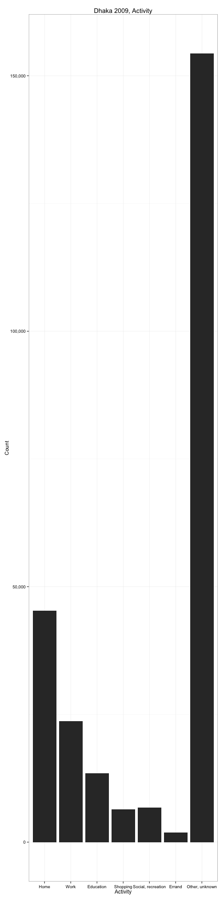
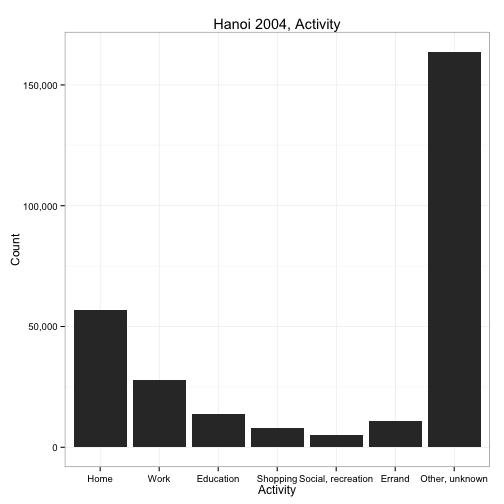
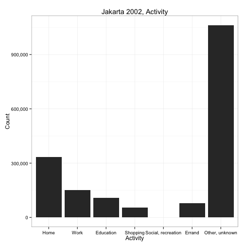
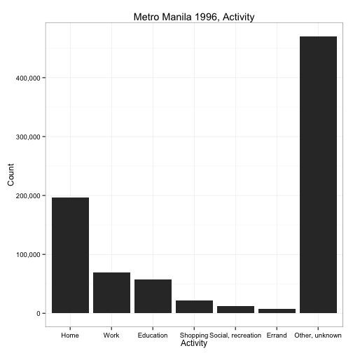
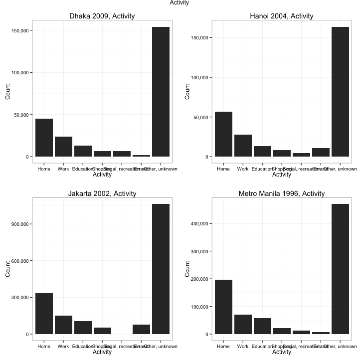

# Capital Cities (Urban Mobility)


## Sample Populations

This section covers the descriptive statistics of the four sample populations.

### Dhaka 2009


The data were captured on October 1-2, 2009 with a sample size of 42,111 people.

Data set description:


```r
format(object.size(dhk09.person), units = "auto")
```

```
## [1] "3.2 Mb"
```

```r
names(dhk09.person)
```

```
## [1] "pid"    "sex"    "age"    "occup"  "occupc"
```

```r
str(dhk09.person)
```

```
## 'data.frame':	42111 obs. of  5 variables:
##  $ pid   : Factor w/ 42114 levels "1","2","3","4",..: 1 2 3 4 5 6 7 8 9 10 ...
##  $ sex   : Factor w/ 2 levels "Male","Female": 1 2 2 1 1 2 2 1 2 2 ...
##  $ age   : Ord.factor w/ 18 levels "[0, 5["<"[5, 10["<..: 11 10 5 4 8 6 2 11 10 10 ...
##  $ occup : Factor w/ 9 levels "Unknown","Government service",..: 3 7 6 6 3 7 6 3 7 7 ...
##  $ occupc: Factor w/ 6 levels "Blue-collar",..: 2 4 3 3 2 4 3 2 4 4 ...
```

```r
levels(dhk09.person$sex)
```

```
## [1] "Male"   "Female"
```

```r
levels(dhk09.person$age)
```

```
##  [1] "[0, 5["    "[5, 10["   "[10, 15["  "[15, 20["  "[20, 25[" 
##  [6] "[25, 30["  "[30, 35["  "[35, 40["  "[40, 45["  "[45, 50[" 
## [11] "[50, 55["  "[55, 60["  "[60, 65["  "[65, 70["  "[70, 75[" 
## [16] "[75, 80["  "[80, 85["  "[85, Inf["
```

```r
levels(dhk09.person$occup)
```

```
## [1] "Unknown"              "Government service"   "Private service"     
## [4] "Business"             "Unemployed"           "Student"             
## [7] "Housewife"            "Agriculture, farming" "Others (specify)"
```

```r
levels(dhk09.person$occupc)
```

```
## [1] "Blue-collar"             "White-collar"           
## [3] "Student"                 "Housewife, househusband"
## [5] "Unemployed, retired"     "Other, unknown"
```

 


### Hanoi 2004


The data were captured on October 1-2, 2004 with a sample size of 58,018 people.

Data set description:


```r
format(object.size(hni04.person), units = "auto")
```

```
## [1] "4.2 Mb"
```

```r
names(hni04.person)
```

```
## [1] "pid"    "sex"    "age"    "occup"  "occupc"
```

```r
str(hni04.person)
```

```
## 'data.frame':	58018 obs. of  5 variables:
##  $ pid   : Factor w/ 58018 levels "2","3","4","5",..: 1 2 3 4 5 6 7 8 9 10 ...
##  $ sex   : Factor w/ 2 levels "Male","Female": 1 1 1 1 1 2 2 1 1 1 ...
##  $ age   : Ord.factor w/ 18 levels "[0, 5["<"[5, 10["<..: 10 12 7 7 6 6 6 13 5 17 ...
##  $ occup : Factor w/ 18 levels "[Undocumented_1]",..: 2 3 5 5 8 5 5 14 14 14 ...
##  $ occupc: Factor w/ 6 levels "Blue-collar",..: 2 2 2 2 1 2 2 5 5 5 ...
```

```r
levels(hni04.person$sex)
```

```
## [1] "Male"   "Female"
```

```r
levels(hni04.person$age)
```

```
##  [1] "[0, 5["    "[5, 10["   "[10, 15["  "[15, 20["  "[20, 25[" 
##  [6] "[25, 30["  "[30, 35["  "[35, 40["  "[40, 45["  "[45, 50[" 
## [11] "[50, 55["  "[55, 60["  "[60, 65["  "[65, 70["  "[70, 75[" 
## [16] "[75, 80["  "[80, 85["  "[85, Inf["
```

```r
levels(hni04.person$occup)
```

```
##  [1] "[Undocumented_1]"                      
##  [2] "Leader of branches, units"             
##  [3] "Professional"                          
##  [4] "Technical and associate professional"  
##  [5] "Clerical worker"                       
##  [6] "Service worker, shop, market sales"    
##  [7] "Skilled agriculture, forestry, fishery"
##  [8] "Craft and related trades"              
##  [9] "Plant, machine operator, assembler"    
## [10] "Elementary occupation"                 
## [11] "Elementary student"                    
## [12] "High school & university student"      
## [13] "Housewife"                             
## [14] "Jobless, retired"                      
## [15] "[Undocumented_2]"                      
## [16] "[Undocumented_3]"                      
## [17] "[Undocumented_4]"                      
## [18] "Unknown"
```

```r
levels(hni04.person$occupc)
```

```
## [1] "Blue-collar"             "White-collar"           
## [3] "Student"                 "Housewife, househusband"
## [5] "Unemployed, retired"     "Other, unknown"
```

 


### Jakarta 2002


The data were captured on October 1-2, 2002 with a sample size of 297,043 people.

Data set description:


```r
format(object.size(jkt02.person), units = "auto")
```

```
## [1] "21.5 Mb"
```

```r
names(jkt02.person)
```

```
## [1] "pid"    "sex"    "age"    "occup"  "occupc"
```

```r
str(jkt02.person)
```

```
## 'data.frame':	297043 obs. of  5 variables:
##  $ pid   : Factor w/ 297043 levels "1","2","3","4",..: 1 2 3 4 5 6 7 8 9 10 ...
##  $ sex   : Factor w/ 2 levels "Male","Female": 1 2 1 1 2 1 2 2 1 2 ...
##  $ age   : Ord.factor w/ 18 levels "[0, 5["<"[5, 10["<..: 8 7 3 14 6 6 5 2 11 10 ...
##  $ occup : Factor w/ 19 levels "Unknown","Professor, manager, director, etc.",..: 3 1 1 6 17 5 1 1 11 8 ...
##  $ occupc: Factor w/ 6 levels "Blue-collar",..: 2 6 6 2 1 3 6 6 1 2 ...
```

```r
levels(jkt02.person$sex)
```

```
## [1] "Male"   "Female"
```

```r
levels(jkt02.person$age)
```

```
##  [1] "[0, 5["    "[5, 10["   "[10, 15["  "[15, 20["  "[20, 25[" 
##  [6] "[25, 30["  "[30, 35["  "[35, 40["  "[40, 45["  "[45, 50[" 
## [11] "[50, 55["  "[55, 60["  "[60, 65["  "[65, 70["  "[70, 75[" 
## [16] "[75, 80["  "[80, 85["  "[85, Inf["
```

```r
levels(jkt02.person$occup)
```

```
##  [1] "Unknown"                                  
##  [2] "Professor, manager, director, etc."       
##  [3] "Industry owner, retail owner, etc."       
##  [4] "Engineer, doctor, accountant, pilot, etc."
##  [5] "Teacher, lecturer"                        
##  [6] "Administration staff"                     
##  [7] "Technician"                               
##  [8] "Waitress"                                 
##  [9] "Vedor, salesman, etc."                    
## [10] "Handyman (carpenter, jewelry)"            
## [11] "Construction, station, port, warehouse"   
## [12] "Laborer"                                  
## [13] "Public transport driver"                  
## [14] "Private driver"                           
## [15] "Housekeeper, office boy, gardener, etc."  
## [16] "Farmer, fisherman, etc."                  
## [17] "Security guard"                           
## [18] "Others"                                   
## [19] "Unknown_2"
```

```r
levels(jkt02.person$occupc)
```

```
## [1] "Blue-collar"             "White-collar"           
## [3] "Student"                 "Housewife, househusband"
## [5] "Unemployed, retired"     "Other, unknown"
```

 


### Metro Manila 1996


The data were captured on October 1-2, 1996 with a sample size of 189,335 people.

Data set description:


```r
format(object.size(mnl96.person), units = "auto")
```

```
## [1] "13.7 Mb"
```

```r
names(mnl96.person)
```

```
## [1] "pid"    "sex"    "age"    "occup"  "occupc"
```

```r
str(mnl96.person)
```

```
## 'data.frame':	189335 obs. of  5 variables:
##  $ pid   : Factor w/ 189335 levels "1","2","3","4",..: 1 2 3 4 5 6 7 8 9 10 ...
##  $ sex   : Factor w/ 2 levels "Male","Female": 1 2 1 2 2 1 1 1 2 2 ...
##  $ age   : Ord.factor w/ 18 levels "[0, 5["<"[5, 10["<..: 8 8 3 3 2 10 4 3 3 4 ...
##  $ occup : Factor w/ 15 levels "Executive","Professional",..: 8 12 10 10 10 5 11 11 10 11 ...
##  $ occupc: Factor w/ 6 levels "Blue-collar",..: 2 4 3 3 3 2 3 3 3 3 ...
```

```r
levels(mnl96.person$sex)
```

```
## [1] "Male"   "Female"
```

```r
levels(mnl96.person$age)
```

```
##  [1] "[0, 5["    "[5, 10["   "[10, 15["  "[15, 20["  "[20, 25[" 
##  [6] "[25, 30["  "[30, 35["  "[35, 40["  "[40, 45["  "[45, 50[" 
## [11] "[50, 55["  "[55, 60["  "[60, 65["  "[65, 70["  "[70, 75[" 
## [16] "[75, 80["  "[80, 85["  "[85, Inf["
```

```r
levels(mnl96.person$occup)
```

```
##  [1] "Executive"    "Professional" "Technician"   "Clerical"    
##  [5] "Service"      "Farmer"       "Trade"        "Operator"    
##  [9] "Laborer"      "Pupil"        "Student"      "Housewife"   
## [13] "Jobless"      "Others"       "Unknown"
```

```r
levels(mnl96.person$occupc)
```

```
## [1] "Blue-collar"             "White-collar"           
## [3] "Student"                 "Housewife, househusband"
## [5] "Unemployed, retired"     "Other, unknown"
```

 


### Comparison Across Cities

#### Sex

 

#### Age

 

#### Occupation

 

#### Occupation Group

 


## Sample Trips

### Dhaka 2009


Data set description:


```r
format(object.size(dhk09.trip), units = "auto")
```

```
## [1] "10.9 Mb"
```

```r
names(dhk09.trip)
```

```
## [1] "pid"      "tno"      "activity" "dist"     "pdate_s"  "pdate_e"
```

```r
str(dhk09.trip)
```

```
## 'data.frame':	251796 obs. of  6 variables:
##  $ pid     : Factor w/ 42114 levels "1","2","3","4",..: 1 1 1 1 1 1 1 1 1 2 ...
##  $ tno     : Factor w/ 21 levels "1","2","3","4",..: 1 2 3 4 5 6 7 8 9 1 ...
##  $ activity: Factor w/ 7 levels "Home","Work",..: 7 2 7 1 7 5 7 1 7 7 ...
##  $ dist    : num  0 8467 0 8469 0 ...
##  $ pdate_s : POSIXct, format: "2009-10-01 00:00:00" "2009-10-01 08:00:00" ...
##  $ pdate_e : POSIXct, format: "2009-10-01 08:00:00" "2009-10-01 09:30:00" ...
```

```r
levels(dhk09.trip$activity)
```

```
## [1] "Home"               "Work"               "Education"         
## [4] "Shopping"           "Social, recreation" "Errand"            
## [7] "Other, unknown"
```

```r
table(dhk09.trip$activity)
```

```
## 
##               Home               Work          Education 
##              45257              23676              13455 
##           Shopping Social, recreation             Errand 
##               6455               6775               1851 
##     Other, unknown 
##             154327
```

 

### Hanoi 2004


Data set description:


```r
format(object.size(hni04.trip), units = "auto")
```

```
## [1] "13.4 Mb"
```

```r
names(hni04.trip)
```

```
## [1] "pid"      "tno"      "activity" "dist"     "pdate_s"  "pdate_e"
```

```r
str(hni04.trip)
```

```
## 'data.frame':	301281 obs. of  6 variables:
##  $ pid     : Factor w/ 58018 levels "2","3","4","5",..: 2 3 3 3 3 3 3 3 3 3 ...
##  $ tno     : Factor w/ 29 levels "1","2","3","4",..: 1 1 2 3 4 5 6 7 8 9 ...
##  $ activity: Factor w/ 7 levels "Home","Work",..: NA 7 2 7 1 7 4 7 1 7 ...
##  $ dist    : num  707 0 2415 504 2812 ...
##  $ pdate_s : POSIXct, format: "2004-10-01 00:00:00" "2004-10-01 00:00:00" ...
##  $ pdate_e : POSIXct, format: "2004-10-01 23:59:00" "2004-10-01 07:00:00" ...
```

```r
levels(hni04.trip$activity)
```

```
## [1] "Home"               "Work"               "Education"         
## [4] "Shopping"           "Social, recreation" "Errand"            
## [7] "Other, unknown"
```

```r
table(hni04.trip$activity)
```

```
## 
##               Home               Work          Education 
##              56799              27966              13628 
##           Shopping Social, recreation             Errand 
##               8065               4903              11011 
##     Other, unknown 
##             163771
```

 

### Jakarta 2002


Data set description:


```r
format(object.size(jkt02.trip), units = "auto")
```

```
## [1] "77.3 Mb"
```

```r
names(jkt02.trip)
```

```
## [1] "pid"      "tno"      "activity" "dist"     "pdate_s"  "pdate_e"
```

```r
str(jkt02.trip)
```

```
## 'data.frame':	1788607 obs. of  6 variables:
##  $ pid     : Factor w/ 297043 levels "1","2","3","4",..: 2 2 2 2 2 3 3 3 3 3 ...
##  $ tno     : Factor w/ 33 levels "1","2","3","4",..: 1 2 3 4 5 1 2 3 4 5 ...
##  $ activity: Factor w/ 7 levels "Home","Work",..: 7 7 7 4 7 7 7 7 3 7 ...
##  $ dist    : num  0 976 0 2851 0 ...
##  $ pdate_s : POSIXct, format: "2002-10-01 00:00:00" "2002-10-01 07:00:00" ...
##  $ pdate_e : POSIXct, format: "2002-10-01 07:00:00" "2002-10-01 07:15:00" ...
```

```r
levels(jkt02.trip$activity)
```

```
## [1] "Home"               "Work"               "Education"         
## [4] "Shopping"           "Social, recreation" "Errand"            
## [7] "Other, unknown"
```

```r
table(jkt02.trip$activity)
```

```
## 
##               Home               Work          Education 
##             334970             152190             107652 
##           Shopping Social, recreation             Errand 
##              53452                  0              77765 
##     Other, unknown 
##            1062578
```

 

### Metro Manila 1996


```
## Error: undefined columns selected
```

Data set description:


```r
format(object.size(mnl96.trip), units = "auto")
```

```
## [1] "29.3 Mb"
```

```r
names(mnl96.trip)
```

```
## [1] "pid"      "tno"      "purpose"  "activity" "dist"
```

```r
str(mnl96.trip)
```

```
## 'data.frame':	836529 obs. of  5 variables:
##  $ pid     : Factor w/ 189335 levels "1","2","3","4",..: 1 1 1 1 1 2 3 3 3 3 ...
##  $ tno     : Factor w/ 40 levels "1","2","3","4",..: 1 2 3 4 5 1 1 2 3 4 ...
##  $ purpose : int  99 2 99 1 99 1 99 3 99 1 ...
##  $ activity: Factor w/ 7 levels "Home","Work",..: 7 2 7 1 7 1 7 3 7 1 ...
##  $ dist    : num  NA NA NA NA NA NA NA NA NA NA ...
```

```r
levels(mnl96.trip$activity)
```

```
## [1] "Home"               "Work"               "Education"         
## [4] "Shopping"           "Social, recreation" "Errand"            
## [7] "Other, unknown"
```

```r
table(mnl96.trip$activity)
```

```
## 
##               Home               Work          Education 
##             196537              69837              57787 
##           Shopping Social, recreation             Errand 
##              21957              12575               7427 
##     Other, unknown 
##             470409
```

 

### Comparison Across Cities

 

## Mobility Behavior

### Dhaka 2009

### Hanoi 2004

### Jakarta 2002

### Metro Manila 1996


## Spatio-Temporal Distribution of Trip Origins

This section covers the analysis of the distribution of the origins of trips in all four cities over space and time. For analysis purposes we generated concentric ring buffers in 5km distances from the centers of all four cities (as per the OpenStreetMap data).


## Final Steps

It's always a good idea to clean up after you're done...


```
## [1] TRUE
```

```
## [1] TRUE
```
