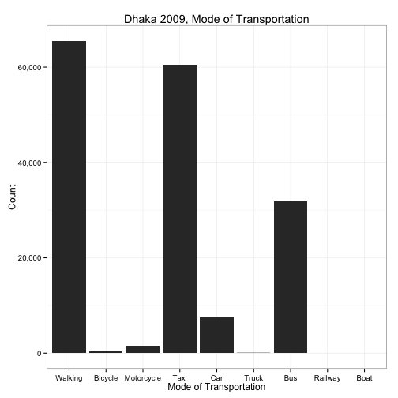
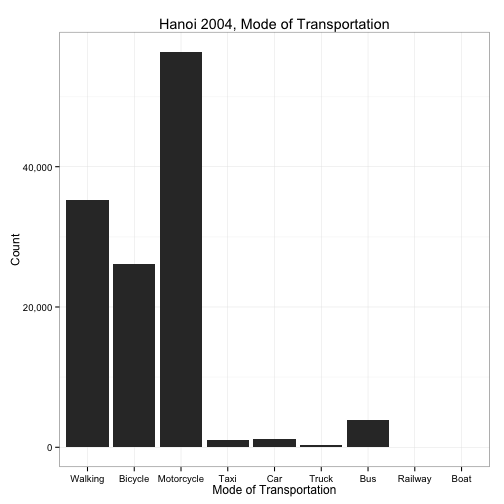
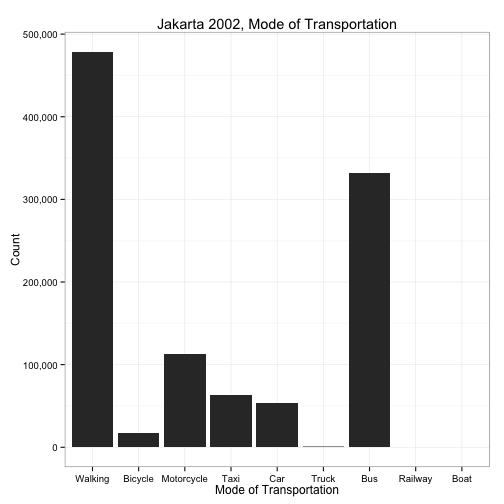
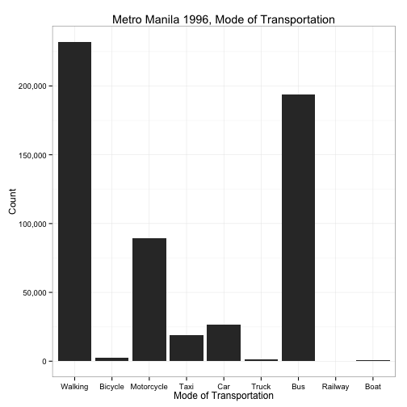
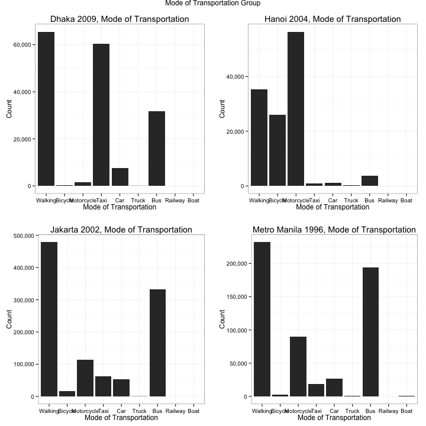

# Capital Cities (Urban Mobility)


## Sample Populations

This section covers the descriptive statistics of the four sample populations.

### Dhaka 2009


The data were captured on October 1-2, 2009 with a sample size of 42,111 people.

Data set description:


```r
format(object.size(dhk09.person), units = "auto")
```

```
## [1] "3.2 Mb"
```

```r
names(dhk09.person)
```

```
## [1] "pid"    "sex"    "age"    "occup"  "occupc"
```

```r
str(dhk09.person)
```

```
## 'data.frame':	42111 obs. of  5 variables:
##  $ pid   : Factor w/ 42114 levels "1","2","3","4",..: 1 2 3 4 5 6 7 8 9 10 ...
##  $ sex   : Factor w/ 2 levels "Male","Female": 1 2 2 1 1 2 2 1 2 2 ...
##  $ age   : Ord.factor w/ 18 levels "[0, 5["<"[5, 10["<..: 11 10 5 4 8 6 2 11 10 10 ...
##  $ occup : Factor w/ 9 levels "Unknown","Government service",..: 3 7 6 6 3 7 6 3 7 7 ...
##  $ occupc: Factor w/ 6 levels "Blue-collar",..: 2 4 3 3 2 4 3 2 4 4 ...
```

```r
levels(dhk09.person$sex)
```

```
## [1] "Male"   "Female"
```

```r
levels(dhk09.person$age)
```

```
##  [1] "[0, 5["    "[5, 10["   "[10, 15["  "[15, 20["  "[20, 25[" 
##  [6] "[25, 30["  "[30, 35["  "[35, 40["  "[40, 45["  "[45, 50[" 
## [11] "[50, 55["  "[55, 60["  "[60, 65["  "[65, 70["  "[70, 75[" 
## [16] "[75, 80["  "[80, 85["  "[85, Inf["
```

```r
levels(dhk09.person$occup)
```

```
## [1] "Unknown"              "Government service"   "Private service"     
## [4] "Business"             "Unemployed"           "Student"             
## [7] "Housewife"            "Agriculture, farming" "Others (specify)"
```

```r
levels(dhk09.person$occupc)
```

```
## [1] "Blue-collar"             "White-collar"           
## [3] "Student"                 "Housewife, househusband"
## [5] "Unemployed, retired"     "Other, unknown"
```

```r
with(dhk09.person, table(age, sex))
```

```
##            sex
## age         Male Female
##   [0, 5[     161    158
##   [5, 10[   1865   1690
##   [10, 15[  2359   2208
##   [15, 20[  2149   2087
##   [20, 25[  2428   2521
##   [25, 30[  2455   2706
##   [30, 35[  2113   2020
##   [35, 40[  2117   1914
##   [40, 45[  1760   1378
##   [45, 50[  1496   1197
##   [50, 55[  1319    804
##   [55, 60[   917    446
##   [60, 65[   714    258
##   [65, 70[   373    103
##   [70, 75[   221     48
##   [75, 80[    74     23
##   [80, 85[    15      6
##   [85, Inf[    5      3
```

 


### Hanoi 2004


The data were captured on October 1-2, 2004 with a sample size of 58,018 people.

Data set description:


```r
format(object.size(hni04.person), units = "auto")
```

```
## [1] "4.2 Mb"
```

```r
names(hni04.person)
```

```
## [1] "pid"    "sex"    "age"    "occup"  "occupc"
```

```r
str(hni04.person)
```

```
## 'data.frame':	58018 obs. of  5 variables:
##  $ pid   : Factor w/ 58018 levels "2","3","4","5",..: 1 2 3 4 5 6 7 8 9 10 ...
##  $ sex   : Factor w/ 2 levels "Male","Female": 1 1 1 1 1 2 2 1 1 1 ...
##  $ age   : Ord.factor w/ 18 levels "[0, 5["<"[5, 10["<..: 10 12 7 7 6 6 6 13 5 17 ...
##  $ occup : Factor w/ 18 levels "[Undocumented_1]",..: 2 3 5 5 8 5 5 14 14 14 ...
##  $ occupc: Factor w/ 6 levels "Blue-collar",..: 2 2 2 2 1 2 2 5 5 5 ...
```

```r
levels(hni04.person$sex)
```

```
## [1] "Male"   "Female"
```

```r
levels(hni04.person$age)
```

```
##  [1] "[0, 5["    "[5, 10["   "[10, 15["  "[15, 20["  "[20, 25[" 
##  [6] "[25, 30["  "[30, 35["  "[35, 40["  "[40, 45["  "[45, 50[" 
## [11] "[50, 55["  "[55, 60["  "[60, 65["  "[65, 70["  "[70, 75[" 
## [16] "[75, 80["  "[80, 85["  "[85, Inf["
```

```r
levels(hni04.person$occup)
```

```
##  [1] "[Undocumented_1]"                      
##  [2] "Leader of branches, units"             
##  [3] "Professional"                          
##  [4] "Technical and associate professional"  
##  [5] "Clerical worker"                       
##  [6] "Service worker, shop, market sales"    
##  [7] "Skilled agriculture, forestry, fishery"
##  [8] "Craft and related trades"              
##  [9] "Plant, machine operator, assembler"    
## [10] "Elementary occupation"                 
## [11] "Elementary student"                    
## [12] "High school & university student"      
## [13] "Housewife"                             
## [14] "Jobless, retired"                      
## [15] "[Undocumented_2]"                      
## [16] "[Undocumented_3]"                      
## [17] "[Undocumented_4]"                      
## [18] "Unknown"
```

```r
levels(hni04.person$occupc)
```

```
## [1] "Blue-collar"             "White-collar"           
## [3] "Student"                 "Housewife, househusband"
## [5] "Unemployed, retired"     "Other, unknown"
```

```r
with(hni04.person, table(age, sex))
```

```
##            sex
## age         Male Female
##   [0, 5[       1      0
##   [5, 10[    870    818
##   [10, 15[  1873   1714
##   [15, 20[  2338   2224
##   [20, 25[  2970   3204
##   [25, 30[  2914   3071
##   [30, 35[  2478   2294
##   [35, 40[  1684   1632
##   [40, 45[  1892   1988
##   [45, 50[  2319   2412
##   [50, 55[  2133   2174
##   [55, 60[  1652   2089
##   [60, 65[  1693   1643
##   [65, 70[  1644   1343
##   [70, 75[  1235    981
##   [75, 80[   709    618
##   [80, 85[   312    461
##   [85, Inf[  175    460
```

 


### Jakarta 2002


The data were captured on October 1-2, 2002 with a sample size of 297,043 people.

Data set description:


```r
format(object.size(jkt02.person), units = "auto")
```

```
## [1] "21.5 Mb"
```

```r
names(jkt02.person)
```

```
## [1] "pid"    "sex"    "age"    "occup"  "occupc"
```

```r
str(jkt02.person)
```

```
## 'data.frame':	297043 obs. of  5 variables:
##  $ pid   : Factor w/ 297043 levels "1","2","3","4",..: 1 2 3 4 5 6 7 8 9 10 ...
##  $ sex   : Factor w/ 2 levels "Male","Female": 1 2 1 1 2 1 2 2 1 2 ...
##  $ age   : Ord.factor w/ 18 levels "[0, 5["<"[5, 10["<..: 8 7 3 14 6 6 5 2 11 10 ...
##  $ occup : Factor w/ 19 levels "Unknown","Professor, manager, director, etc.",..: 3 1 1 6 17 5 1 1 11 8 ...
##  $ occupc: Factor w/ 6 levels "Blue-collar",..: 2 6 6 2 1 3 6 6 1 2 ...
```

```r
levels(jkt02.person$sex)
```

```
## [1] "Male"   "Female"
```

```r
levels(jkt02.person$age)
```

```
##  [1] "[0, 5["    "[5, 10["   "[10, 15["  "[15, 20["  "[20, 25[" 
##  [6] "[25, 30["  "[30, 35["  "[35, 40["  "[40, 45["  "[45, 50[" 
## [11] "[50, 55["  "[55, 60["  "[60, 65["  "[65, 70["  "[70, 75[" 
## [16] "[75, 80["  "[80, 85["  "[85, Inf["
```

```r
levels(jkt02.person$occup)
```

```
##  [1] "Unknown"                                  
##  [2] "Professor, manager, director, etc."       
##  [3] "Industry owner, retail owner, etc."       
##  [4] "Engineer, doctor, accountant, pilot, etc."
##  [5] "Teacher, lecturer"                        
##  [6] "Administration staff"                     
##  [7] "Technician"                               
##  [8] "Waitress"                                 
##  [9] "Vedor, salesman, etc."                    
## [10] "Handyman (carpenter, jewelry)"            
## [11] "Construction, station, port, warehouse"   
## [12] "Laborer"                                  
## [13] "Public transport driver"                  
## [14] "Private driver"                           
## [15] "Housekeeper, office boy, gardener, etc."  
## [16] "Farmer, fisherman, etc."                  
## [17] "Security guard"                           
## [18] "Others"                                   
## [19] "Unknown_2"
```

```r
levels(jkt02.person$occupc)
```

```
## [1] "Blue-collar"             "White-collar"           
## [3] "Student"                 "Housewife, househusband"
## [5] "Unemployed, retired"     "Other, unknown"
```

```r
with(jkt02.person, table(age, sex))
```

```
##            sex
## age          Male Female
##   [0, 5[        0      0
##   [5, 10[   12373  12164
##   [10, 15[  15586  12744
##   [15, 20[  15736  17201
##   [20, 25[  16262  20321
##   [25, 30[  21772  21490
##   [30, 35[  16349  12023
##   [35, 40[  14546  11973
##   [40, 45[  11686   9937
##   [45, 50[  10988   8045
##   [50, 55[   8619   5582
##   [55, 60[   3855   2624
##   [60, 65[   4462   2276
##   [65, 70[   3219   1564
##   [70, 75[   1863    788
##   [75, 80[    192     59
##   [80, 85[     67    425
##   [85, Inf[     8    244
```

 


### Metro Manila 1996


The data were captured on October 1-2, 1996 with a sample size of 189,335 people.

Data set description:


```r
format(object.size(mnl96.person), units = "auto")
```

```
## [1] "13.7 Mb"
```

```r
names(mnl96.person)
```

```
## [1] "pid"    "sex"    "age"    "occup"  "occupc"
```

```r
str(mnl96.person)
```

```
## 'data.frame':	189335 obs. of  5 variables:
##  $ pid   : Factor w/ 189335 levels "1","2","3","4",..: 1 2 3 4 5 6 7 8 9 10 ...
##  $ sex   : Factor w/ 2 levels "Male","Female": 1 2 1 2 2 1 1 1 2 2 ...
##  $ age   : Ord.factor w/ 18 levels "[0, 5["<"[5, 10["<..: 8 8 3 3 2 10 4 3 3 4 ...
##  $ occup : Factor w/ 15 levels "Executive","Professional",..: 8 12 10 10 10 5 11 11 10 11 ...
##  $ occupc: Factor w/ 6 levels "Blue-collar",..: 2 4 3 3 3 2 3 3 3 3 ...
```

```r
levels(mnl96.person$sex)
```

```
## [1] "Male"   "Female"
```

```r
levels(mnl96.person$age)
```

```
##  [1] "[0, 5["    "[5, 10["   "[10, 15["  "[15, 20["  "[20, 25[" 
##  [6] "[25, 30["  "[30, 35["  "[35, 40["  "[40, 45["  "[45, 50[" 
## [11] "[50, 55["  "[55, 60["  "[60, 65["  "[65, 70["  "[70, 75[" 
## [16] "[75, 80["  "[80, 85["  "[85, Inf["
```

```r
levels(mnl96.person$occup)
```

```
##  [1] "Executive"    "Professional" "Technician"   "Clerical"    
##  [5] "Service"      "Farmer"       "Trade"        "Operator"    
##  [9] "Laborer"      "Pupil"        "Student"      "Housewife"   
## [13] "Jobless"      "Others"       "Unknown"
```

```r
levels(mnl96.person$occupc)
```

```
## [1] "Blue-collar"             "White-collar"           
## [3] "Student"                 "Housewife, househusband"
## [5] "Unemployed, retired"     "Other, unknown"
```

```r
with(mnl96.person, table(age, sex))
```

```
##            sex
## age          Male Female
##   [0, 5[     1291   1326
##   [5, 10[   11284  10841
##   [10, 15[  10748  10962
##   [15, 20[  10389  11931
##   [20, 25[   9118  11265
##   [25, 30[   8397  10601
##   [30, 35[   7498   9573
##   [35, 40[   6993   8669
##   [40, 45[   5940   7486
##   [45, 50[   5137   6032
##   [50, 55[   3855   4419
##   [55, 60[   2728   3223
##   [60, 65[   2077   2328
##   [65, 70[   1357   1586
##   [70, 75[    522    616
##   [75, 80[    249    348
##   [80, 85[    109    222
##   [85, Inf[    76    139
```

 


### Comparison Across Cities

#### Sex

 

#### Age

 

#### Occupation

 

#### Occupation Group

 


## Sample Trips

### Dhaka 2009


The 42,111 people in the sample made a total of 251,796 trips.

Data set description:


```r
format(object.size(dhk09.trip), units = "auto")
```

```
## [1] "10.9 Mb"
```

```r
names(dhk09.trip)
```

```
## [1] "pid"      "tno"      "activity" "dist"     "pdate_s"  "pdate_e"
```

```r
str(dhk09.trip)
```

```
## 'data.frame':	251796 obs. of  6 variables:
##  $ pid     : Factor w/ 42114 levels "1","2","3","4",..: 2 2 2 2 2 3 3 3 3 3 ...
##  $ tno     : Factor w/ 21 levels "1","2","3","4",..: 1 2 3 4 5 1 2 3 4 5 ...
##  $ activity: Factor w/ 7 levels "Home","Work",..: 7 4 7 1 7 7 3 7 1 7 ...
##  $ dist    : num  0 2550 0 2422 0 ...
##  $ pdate_s : POSIXct, format: "2009-10-01 00:00:00" "2009-10-01 16:00:00" ...
##  $ pdate_e : POSIXct, format: "2009-10-01 16:00:00" "2009-10-01 16:20:00" ...
```

```r
levels(dhk09.trip$activity)
```

```
## [1] "Home"               "Work"               "Education"         
## [4] "Shopping"           "Social, recreation" "Errand"            
## [7] "Other, unknown"
```

```r
table(dhk09.trip$activity)
```

```
## 
##               Home               Work          Education 
##              45260              23677              13455 
##           Shopping Social, recreation             Errand 
##               6455               6776               1851 
##     Other, unknown 
##             154322
```

 

### Hanoi 2004


The 58,018 people in the sample made a total of 301,281 trips.

Data set description:


```r
format(object.size(hni04.trip), units = "auto")
```

```
## [1] "13.4 Mb"
```

```r
names(hni04.trip)
```

```
## [1] "pid"      "tno"      "activity" "dist"     "pdate_s"  "pdate_e"
```

```r
str(hni04.trip)
```

```
## 'data.frame':	301281 obs. of  6 variables:
##  $ pid     : Factor w/ 58018 levels "2","3","4","5",..: 2 3 3 3 3 3 3 3 3 3 ...
##  $ tno     : Factor w/ 29 levels "1","2","3","4",..: 1 1 2 3 4 5 6 7 8 9 ...
##  $ activity: Factor w/ 7 levels "Home","Work",..: NA 7 2 7 1 7 4 7 1 7 ...
##  $ dist    : num  707 0 2415 504 2812 ...
##  $ pdate_s : POSIXct, format: "2004-10-01 00:00:00" "2004-10-01 00:00:00" ...
##  $ pdate_e : POSIXct, format: "2004-10-01 23:59:00" "2004-10-01 07:00:00" ...
```

```r
levels(hni04.trip$activity)
```

```
## [1] "Home"               "Work"               "Education"         
## [4] "Shopping"           "Social, recreation" "Errand"            
## [7] "Other, unknown"
```

```r
table(hni04.trip$activity)
```

```
## 
##               Home               Work          Education 
##              56799              27966              13628 
##           Shopping Social, recreation             Errand 
##               8065               4903              11011 
##     Other, unknown 
##             163771
```

 

### Jakarta 2002


The 297,043 people in the sample made a total of 1,788,607 trips.

Data set description:


```r
format(object.size(jkt02.trip), units = "auto")
```

```
## [1] "77.3 Mb"
```

```r
names(jkt02.trip)
```

```
## [1] "pid"      "tno"      "activity" "dist"     "pdate_s"  "pdate_e"
```

```r
str(jkt02.trip)
```

```
## 'data.frame':	1788607 obs. of  6 variables:
##  $ pid     : Factor w/ 297043 levels "1","2","3","4",..: 2 2 2 2 2 3 3 3 3 3 ...
##  $ tno     : Factor w/ 33 levels "1","2","3","4",..: 1 2 3 4 5 1 2 3 4 5 ...
##  $ activity: Factor w/ 7 levels "Home","Work",..: 7 7 7 4 7 7 7 7 3 7 ...
##  $ dist    : num  0 976 0 2851 0 ...
##  $ pdate_s : POSIXct, format: "2002-10-01 00:00:00" "2002-10-01 07:00:00" ...
##  $ pdate_e : POSIXct, format: "2002-10-01 07:00:00" "2002-10-01 07:15:00" ...
```

```r
levels(jkt02.trip$activity)
```

```
## [1] "Home"               "Work"               "Education"         
## [4] "Shopping"           "Social, recreation" "Errand"            
## [7] "Other, unknown"
```

```r
table(jkt02.trip$activity)
```

```
## 
##               Home               Work          Education 
##             334970             152190             107652 
##           Shopping Social, recreation             Errand 
##              53452                  0              77765 
##     Other, unknown 
##            1062578
```

 

### Metro Manila 1996


The 189,335 people in the sample made a total of 836,529 trips.

Data set description:


```r
format(object.size(mnl96.trip), units = "auto")
```

```
## [1] "26.1 Mb"
```

```r
names(mnl96.trip)
```

```
## [1] "pid"      "tno"      "activity" "dist"
```

```r
str(mnl96.trip)
```

```
## 'data.frame':	836529 obs. of  4 variables:
##  $ pid     : Factor w/ 189335 levels "1","2","3","4",..: 1 1 1 1 1 2 3 3 3 3 ...
##  $ tno     : Factor w/ 40 levels "1","2","3","4",..: 1 2 3 4 5 1 1 2 3 4 ...
##  $ activity: Factor w/ 7 levels "Home","Work",..: 7 2 7 1 7 1 7 3 7 1 ...
##  $ dist    : num  NA NA NA NA NA NA NA NA NA NA ...
```

```r
levels(mnl96.trip$activity)
```

```
## [1] "Home"               "Work"               "Education"         
## [4] "Shopping"           "Social, recreation" "Errand"            
## [7] "Other, unknown"
```

```r
table(mnl96.trip$activity)
```

```
## 
##               Home               Work          Education 
##             196537              69837              57787 
##           Shopping Social, recreation             Errand 
##              21957              12575               7427 
##     Other, unknown 
##             470409
```

 

### Comparison Across Cities

 


## Sample Subtrips

### Dhaka 2009


The 42,111 people in the sample made a total of 167,354 subtrips. 87.6% of these are actually stationarity events, which reduces the true number of subtrips to 20,679.

Data set description:


```r
format(object.size(dhk09.subtrip), units = "auto")
```

```
## [1] "10.6 Mb"
```

```r
names(dhk09.subtrip)
```

```
## [1] "pid"      "tno"      "sno"      "tmode"    "tmodec"   "activity"
## [7] "dist"     "pdate_s"  "pdate_e"
```

```r
str(dhk09.subtrip)
```

```
## 'data.frame':	167354 obs. of  9 variables:
##  $ pid     : Factor w/ 42114 levels "1","2","3","4",..: 25 25 26 26 27 27 28 28 28 28 ...
##  $ tno     : Factor w/ 21 levels "1","2","3","4",..: 8 8 2 4 2 4 2 4 6 8 ...
##  $ sno     : Factor w/ 5 levels "1","2","3","4",..: 1 2 1 1 1 1 1 1 1 1 ...
##  $ tmode   : Factor w/ 22 levels "Walking","Bicycle",..: 1 15 1 1 1 1 6 6 6 6 ...
##  $ tmodec  : Factor w/ 9 levels "Walking","Bicycle",..: 1 4 1 1 1 1 5 5 5 5 ...
##  $ activity: Factor w/ 7 levels "Home","Work",..: NA NA NA NA NA NA NA NA NA NA ...
##  $ dist    : num  2189 1318 1177 1177 869 ...
##  $ pdate_s : POSIXct, format: "2009-10-01 21:00:00" "2009-10-01 21:10:00" ...
##  $ pdate_e : POSIXct, format: "2009-10-01 21:10:00" "2009-10-01 21:20:00" ...
```

```r
levels(dhk09.subtrip$tmodec)
```

```
## [1] "Walking"    "Bicycle"    "Motorcycle" "Taxi"       "Car"       
## [6] "Truck"      "Bus"        "Railway"    "Boat"
```

```r
table(dhk09.subtrip$tmodec)
```

```
## 
##    Walking    Bicycle Motorcycle       Taxi        Car      Truck 
##      65527        410       1529      60471       7563         57 
##        Bus    Railway       Boat 
##      31797          0          0
```

```r
levels(dhk09.subtrip$activity)
```

```
## [1] "Home"               "Work"               "Education"         
## [4] "Shopping"           "Social, recreation" "Errand"            
## [7] "Other, unknown"
```

```r
table(dhk09.subtrip$activity)
```

```
## 
##               Home               Work          Education 
##                  0                  0                  0 
##           Shopping Social, recreation             Errand 
##                  0                  0                  0 
##     Other, unknown 
##                  0
```

 

### Hanoi 2004


The 58,018 people in the sample made a total of 124,062 subtrips. 144.1% of these are actually stationarity events, which reduces the true number of subtrips to -54,689.

Data set description:


```r
format(object.size(hni04.subtrip), units = "auto")
```

```
## [1] "9.3 Mb"
```

```r
names(hni04.subtrip)
```

```
## [1] "pid"      "tno"      "sno"      "tmode"    "tmodec"   "activity"
## [7] "dist"     "pdate_s"  "pdate_e"
```

```r
str(hni04.subtrip)
```

```
## 'data.frame':	124062 obs. of  9 variables:
##  $ pid     : Factor w/ 58018 levels "2","3","4","5",..: 1 1 3 3 3 3 5 5 5 6 ...
##  $ tno     : Factor w/ 29 levels "1","2","3","4",..: 2 4 2 4 6 8 2 4 6 2 ...
##  $ sno     : Factor w/ 4 levels "1","2","3","4": 1 1 1 1 1 1 1 1 1 1 ...
##  $ tmode   : Factor w/ 21 levels "Walking","Bicycle",..: 3 3 3 3 3 3 3 3 3 4 ...
##  $ tmodec  : Factor w/ 9 levels "Walking","Bicycle",..: 3 3 3 3 3 3 3 3 3 3 ...
##  $ activity: Factor w/ 7 levels "Home","Work",..: NA NA NA NA NA NA NA NA NA NA ...
##  $ dist    : num  10674 11336 2415 2812 1245 ...
##  $ pdate_s : POSIXct, format: "2004-10-01 06:45:00" "2004-10-01 18:00:00" ...
##  $ pdate_e : POSIXct, format: "2004-10-01 08:00:00" "2004-10-01 19:00:00" ...
```

```r
levels(hni04.subtrip$tmodec)
```

```
## [1] "Walking"    "Bicycle"    "Motorcycle" "Taxi"       "Car"       
## [6] "Truck"      "Bus"        "Railway"    "Boat"
```

```r
table(hni04.subtrip$tmodec)
```

```
## 
##    Walking    Bicycle Motorcycle       Taxi        Car      Truck 
##      35301      26091      56399        970       1177        302 
##        Bus    Railway       Boat 
##       3822          0          0
```

```r
levels(hni04.subtrip$activity)
```

```
## [1] "Home"               "Work"               "Education"         
## [4] "Shopping"           "Social, recreation" "Errand"            
## [7] "Other, unknown"
```

```r
table(hni04.subtrip$activity)
```

```
## 
##               Home               Work          Education 
##                  0                  0                  0 
##           Shopping Social, recreation             Errand 
##                  0                  0                  0 
##     Other, unknown 
##                  0
```

 

### Jakarta 2002


The 297,043 people in the sample made a total of 1,058,822 subtrips. 98.5% of these are actually stationarity events, which reduces the true number of subtrips to 16,364.

Data set description:


```r
format(object.size(jkt02.subtrip), units = "auto")
```

```
## [1] "68.4 Mb"
```

```r
names(jkt02.subtrip)
```

```
## [1] "pid"      "tno"      "sno"      "tmode"    "tmodec"   "activity"
## [7] "dist"     "pdate_s"  "pdate_e"
```

```r
str(jkt02.subtrip)
```

```
## 'data.frame':	1058822 obs. of  9 variables:
##  $ pid     : Factor w/ 297043 levels "1","2","3","4",..: 1 1 1 1 1 1 1 2 2 3 ...
##  $ tno     : Factor w/ 33 levels "1","2","3","4",..: 2 4 6 8 10 12 14 2 4 2 ...
##  $ sno     : Factor w/ 6 levels "1","2","3","4",..: 1 1 1 1 1 1 1 1 1 1 ...
##  $ tmode   : Factor w/ 23 levels "Walking to final destination",..: 5 5 5 5 5 5 5 1 1 1 ...
##  $ tmodec  : Factor w/ 9 levels "Walking","Bicycle",..: 5 5 5 5 5 5 5 1 1 1 ...
##  $ activity: Factor w/ 7 levels "Home","Work",..: NA NA NA NA NA NA NA NA NA NA ...
##  $ dist    : num  3929 2428 2088 5709 9023 ...
##  $ pdate_s : POSIXct, format: "2002-10-01 07:30:00" "2002-10-01 09:00:00" ...
##  $ pdate_e : POSIXct, format: "2002-10-01 08:05:00" "2002-10-01 09:10:00" ...
```

```r
levels(jkt02.subtrip$tmodec)
```

```
## [1] "Walking"    "Bicycle"    "Motorcycle" "Taxi"       "Car"       
## [6] "Truck"      "Bus"        "Railway"    "Boat"
```

```r
table(jkt02.subtrip$tmodec)
```

```
## 
##    Walking    Bicycle Motorcycle       Taxi        Car      Truck 
##     478734      17169     113412      63061      54107        636 
##        Bus    Railway       Boat 
##     331703          0          0
```

```r
levels(jkt02.subtrip$activity)
```

```
## [1] "Home"               "Work"               "Education"         
## [4] "Shopping"           "Social, recreation" "Errand"            
## [7] "Other, unknown"
```

```r
table(jkt02.subtrip$activity)
```

```
## 
##               Home               Work          Education 
##                  0                  0                  0 
##           Shopping Social, recreation             Errand 
##                  0                  0                  0 
##     Other, unknown 
##                  0
```

 

### Metro Manila 1996


The 189,335 people in the sample made a total of 565,041 subtrips. 90.7% of these are actually stationarity events, which reduces the true number of subtrips to 52,824.

Data set description:


```r
format(object.size(mnl96.subtrip), units = "auto")
```

```
## [1] "27.4 Mb"
```

```r
names(mnl96.subtrip)
```

```
## [1] "pid"      "tno"      "sno"      "tmode"    "tmodec"   "activity"
## [7] "dist"
```

```r
str(mnl96.subtrip)
```

```
## 'data.frame':	565041 obs. of  7 variables:
##  $ pid     : Factor w/ 189335 levels "1","2","3","4",..: 1 1 3 3 3 3 3 3 4 4 ...
##  $ tno     : Factor w/ 40 levels "1","2","3","4",..: 2 4 2 2 2 4 4 4 2 4 ...
##  $ sno     : Factor w/ 9 levels "1","2","3","4",..: 1 1 1 2 3 1 2 3 1 1 ...
##  $ tmode   : Factor w/ 21 levels "Walking","Pedicab",..: 1 1 1 6 1 1 6 1 2 1 ...
##  $ tmodec  : Factor w/ 9 levels "Walking","Bicycle",..: 1 1 1 7 1 1 7 1 4 1 ...
##  $ activity: Factor w/ 7 levels "Home","Work",..: NA NA NA NA NA NA NA NA NA NA ...
##  $ dist    : num  NA NA NA NA NA NA NA NA NA NA ...
```

```r
levels(mnl96.subtrip$tmodec)
```

```
## [1] "Walking"    "Bicycle"    "Motorcycle" "Taxi"       "Car"       
## [6] "Truck"      "Bus"        "Railway"    "Boat"
```

```r
table(mnl96.subtrip$tmodec)
```

```
## 
##    Walking    Bicycle Motorcycle       Taxi        Car      Truck 
##     232123       2292      89554      19110      26347       1308 
##        Bus    Railway       Boat 
##     193627          0        680
```

```r
levels(mnl96.subtrip$activity)
```

```
## [1] "Home"               "Work"               "Education"         
## [4] "Shopping"           "Social, recreation" "Errand"            
## [7] "Other, unknown"
```

```r
table(mnl96.subtrip$activity)
```

```
## 
##               Home               Work          Education 
##                  0                  0                  0 
##           Shopping Social, recreation             Errand 
##                  0                  0                  0 
##     Other, unknown 
##                  0
```

 

### Comparison Across Cities

 


## Mobility Behavior

### Dhaka 2009

### Hanoi 2004

### Jakarta 2002

### Metro Manila 1996


## Spatio-Temporal Distribution of Trip Origins

This section covers the analysis of the distribution of the origins of trips in all four cities over space and time. For analysis purposes we generated concentric ring buffers in 5km distances from the centers of all four cities (as per the OpenStreetMap data).


## Final Steps

It's always a good idea to clean up after you're done...


```
## [1] TRUE
```

```
## [1] TRUE
```
