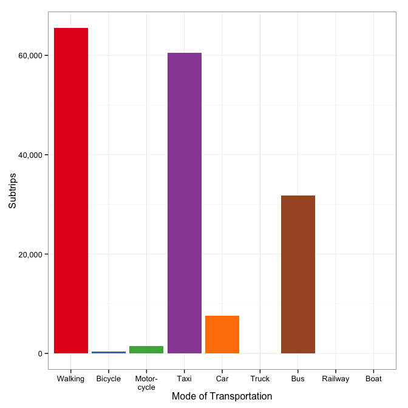
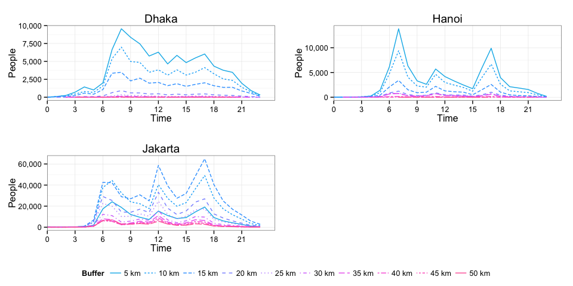

# Capital Cities (Urban Mobility)

Capital Cities (Urban Mobility)
===============================


## Sample Populations

This section covers the descriptive statistics of the four sample populations.

### Dhaka 2009


The data were captured on October 1-2, 2009 with a sample size of 42,111 people. The personal data occupies 4 Mb of memory.

Data set description:


```r
describe(dhk09.person)
```

```
## dhk09.person 
## 
##  9  Variables      42111  Observations
## ---------------------------------------------------------------------------
## pid 
##       n missing  unique 
##   42111       0   42111 
## 
## lowest : 1     2     3     4     5    
## highest: 47486 47489 47491 47492 47493 
## ---------------------------------------------------------------------------
## age 
##       n missing  unique 
##   42111       0      18 
## 
##           [0, 5[ [5, 10[ [10, 15[ [15, 20[ [20, 25[ [25, 30[ [30, 35[
## Frequency    319    3555     4567     4236     4949     5161     4133
## %              1       8       11       10       12       12       10
##           [35, 40[ [40, 45[ [45, 50[ [50, 55[ [55, 60[ [60, 65[ [65, 70[
## Frequency     4031     3138     2693     2123     1363      972      476
## %               10        7        6        5        3        2        1
##           [70, 75[ [75, 80[ [80, 85[ [85, Inf[
## Frequency      269       97       21         8
## %                1        0        0         0
## ---------------------------------------------------------------------------
## sex 
##       n missing  unique 
##   42111       0       2 
## 
## Male (22541, 54%), Female (19570, 46%) 
## ---------------------------------------------------------------------------
## padd 
##       n missing  unique    Mean     .05     .10     .25     .50     .75 
##   42111       0      87   42.37       3       6      15      39      64 
##     .90     .95 
##      87      90 
## 
## lowest :   1   2   3   4   5, highest:  99 100 105 106 107 
## ---------------------------------------------------------------------------
## occup 
##       n missing  unique 
##   42111       0       9 
## 
## Unknown (865, 2%), Government service (1925, 5%) 
## Private service (6901, 16%) 
## Business (6468, 15%), Unemployed (841, 2%) 
## Student (13861, 33%), Housewife (10571, 25%) 
## Agriculture, farming (31, 0%) 
## Others (specify) (648, 2%) 
## ---------------------------------------------------------------------------
## magfac 
##       n missing  unique    Mean     .05     .10     .25     .50     .75 
##   42111       0      65   149.3      60      86     106     118     148 
##     .90     .95 
##     191     353 
## 
## lowest :   44   60   82   84   85, highest:  615  631  681  781 1000 
## ---------------------------------------------------------------------------
## magfac2 
##       n missing  unique    Mean 
##   42111       0       1       0 
## ---------------------------------------------------------------------------
## dist 
##       n missing  unique    Mean     .05     .10     .25     .50     .75 
##   42111       0   42087   12167    1615    2303    4160    8392   15993 
##     .90     .95 
##   26166   34859 
## 
## lowest :      0.0    216.2    216.5    237.4    258.3
## highest: 128980.7 129057.7 137385.7 157069.2 185058.2 
## ---------------------------------------------------------------------------
## occupc 
##       n missing  unique 
##   42111       0       6 
## 
## Blue-collar (31, 0%), White-collar (15294, 36%) 
## Student (13861, 33%) 
## Housewife,
## househusband (10571, 25%) 
## Unemployed,
## retired (841, 2%) 
## Other,
## unknown (1513, 4%) 
## ---------------------------------------------------------------------------
```

 

### Hanoi 2004


The data were captured on October 1-2, 2004 with a sample size of 58,018 people.  The personal data occupies 5.3 Mb of memory.

Data set description:


```r
describe(hni04.person)
```

```
## hni04.person 
## 
##  9  Variables      58018  Observations
## ---------------------------------------------------------------------------
## pid 
##       n missing  unique 
##   58018       0   58018 
## 
## lowest : 2     3     4     5     6    
## highest: 75914 75915 75916 75917 75918 
## ---------------------------------------------------------------------------
## age 
##       n missing  unique 
##   58018       0      18 
## 
##           [0, 5[ [5, 10[ [10, 15[ [15, 20[ [20, 25[ [25, 30[ [30, 35[
## Frequency      1    1688     3587     4562     6174     5985     4772
## %              0       3        6        8       11       10        8
##           [35, 40[ [40, 45[ [45, 50[ [50, 55[ [55, 60[ [60, 65[ [65, 70[
## Frequency     3316     3880     4731     4307     3741     3336     2987
## %                6        7        8        7        6        6        5
##           [70, 75[ [75, 80[ [80, 85[ [85, Inf[
## Frequency     2216     1327      773       635
## %                4        2        1         1
## ---------------------------------------------------------------------------
## sex 
##       n missing  unique 
##   58018       0       2 
## 
## Male (28892, 50%), Female (29126, 50%) 
## ---------------------------------------------------------------------------
## padd 
##       n missing  unique    Mean     .05     .10     .25     .50     .75 
##   58018       0     299   118.5       9      20      51      98     185 
##     .90     .95 
##     242     276 
## 
## lowest :   1   2   3   4   5, highest: 295 296 297 298 299 
## ---------------------------------------------------------------------------
## occup 
##       n missing  unique 
##   58018       0      18 
## 
## [Undocumented_1] (19, 0%) 
## Leader of branches, units (811, 1%) 
## Professional (1869, 3%) 
## Technical and associate professional (2212, 4%) 
## Clerical worker (7668, 13%) 
## Service worker, shop, market sales (825, 1%) 
## Skilled agriculture, forestry, fishery (5214, 9%) 
## Craft and related trades (2600, 4%) 
## Plant, machine operator, assembler (1046, 2%) 
## Elementary occupation (2829, 5%) 
## Elementary student (8937, 15%) 
## High school & university student (2892, 5%) 
## Housewife (1504, 3%), Jobless, retired (15206, 26%) 
## [Undocumented_2] (4023, 7%) 
## [Undocumented_3] (144, 0%) 
## [Undocumented_4] (119, 0%), Unknown (100, 0%) 
## ---------------------------------------------------------------------------
## magfac 
##       n missing  unique    Mean     .05     .10     .25     .50     .75 
##   58018       0      96    16.9       0       0       0      10      20 
##     .90     .95 
##      30      45 
## 
## lowest :    0    1    2    3    4, highest: 1801 2101 2701 3301 3601 
## ---------------------------------------------------------------------------
## magfac2 
##       n missing  unique    Mean     .05     .10     .25     .50     .75 
##   58018       0      14   45.93      21      46      47      48      49 
##     .90     .95 
##      49      50 
## 
##           13  14   20   21  22  45   46    47    48    49   50  51  52 53
## Frequency 46 721 1340 1628 472 124 4640 16833 13368 13442 4081 875 364 84
## %          0   1    2    3   1   0    8    29    23    23    7   2   1  0
## ---------------------------------------------------------------------------
## dist 
##       n missing  unique    Mean     .05     .10     .25     .50     .75 
##   58018       0   57305   16487   286.3   507.7  2297.9 11264.8 23787.6 
##     .90     .95 
## 39120.7 50567.3 
## 
## lowest : 0.000e+00 3.117e-01 3.117e-01 3.117e-01 3.117e-01
## highest: 2.039e+05 2.251e+05 2.376e+05 2.642e+05 2.746e+05 
## ---------------------------------------------------------------------------
## occupc 
##       n missing  unique 
##   58018       0       6 
## 
## Blue-collar (11689, 20%) 
## White-collar (13385, 23%), Student (11829, 20%) 
## Housewife,
## househusband (1504, 3%) 
## Unemployed,
## retired (15206, 26%) 
## Other,
## unknown (4405, 8%) 
## ---------------------------------------------------------------------------
```

 

### Jakarta 2002


The data were captured on October 1-2, 2002 with a sample size of 297,043 people.  The personal data occupies 27.2 Mb of memory.

Data set description:


```r
describe(jkt02.person)
```

```
## jkt02.person 
## 
##  9  Variables      297043  Observations
## ---------------------------------------------------------------------------
## pid 
##       n missing  unique 
##  297043       0  297043 
## 
## lowest : 1      2      3      4      6     
## highest: 416994 417004 417009 417027 417029 
## ---------------------------------------------------------------------------
## age 
##       n missing  unique 
##  297043       0      17 
## 
##           [5, 10[ [10, 15[ [15, 20[ [20, 25[ [25, 30[ [30, 35[ [35, 40[
## Frequency   24537    28330    32937    36583    43262    28372    26519
## %               8       10       11       12       15       10        9
##           [40, 45[ [45, 50[ [50, 55[ [55, 60[ [60, 65[ [65, 70[ [70, 75[
## Frequency    21623    19033    14201     6479     6738     4783     2651
## %                7        6        5        2        2        2        1
##           [75, 80[ [80, 85[ [85, Inf[
## Frequency      251      492       252
## %                0        0         0
## ---------------------------------------------------------------------------
## sex 
##       n missing  unique 
##  297043       0       2 
## 
## Male (157583, 53%), Female (139460, 47%) 
## ---------------------------------------------------------------------------
## padd 
##       n missing  unique    Mean     .05     .10     .25     .50     .75 
##  297043       0      33 1111150 1101010 1101010 1101010 1101010 1101020 
##     .90     .95 
## 1101050 1202030 
## 
## lowest : 1101010 1101020 1101030 1101040 1101050
## highest: 1506010 2201080 2209100 3102110 4207130 
## ---------------------------------------------------------------------------
## occup 
##       n missing  unique 
##  297043       0      18 
## 
## Unknown (164947, 56%) 
## Professor, manager, director, etc. (8969, 3%) 
## Industry owner, retail owner, etc. (8972, 3%) 
## Engineer, doctor, accountant, pilot, etc. (10854, 4%) 
## Teacher, lecturer (7821, 3%) 
## Administration staff (21833, 7%) 
## Technician (6740, 2%), Waitress (14227, 5%) 
## Vedor, salesman, etc. (13108, 4%) 
## Handyman (carpenter, jewelry) (10230, 3%) 
## Construction, station, port, warehouse (4395, 1%) 
## Laborer (2735, 1%), Public transport driver (1641, 1%) 
## Private driver (5238, 2%) 
## Housekeeper, office boy, gardener, etc. (4564, 2%) 
## Farmer, fisherman, etc. (66, 0%) 
## Security guard (5524, 2%), Others (5179, 2%) 
## ---------------------------------------------------------------------------
## magfac 
##       n missing  unique    Mean     .05     .10     .25     .50     .75 
##  297043       0      89   34.61      25      26      28      31      37 
##     .90     .95 
##      51      58 
## 
## lowest :  14  15  17  18  19, highest: 302 303 304 305 306 
## ---------------------------------------------------------------------------
## magfac2 
##       n missing  unique    Mean 
##  297043       0       1       0 
## ---------------------------------------------------------------------------
## dist 
##       n missing  unique    Mean     .05     .10     .25     .50     .75 
##  297043       0  297043   38325    9299   13002   20191   32585   48533 
##     .90     .95 
##   70055   87754 
## 
## lowest :    240.1    270.0    275.9    321.0    335.1
## highest: 411321.8 412853.2 415169.5 438369.6 504843.6 
## ---------------------------------------------------------------------------
## occupc 
##       n missing  unique 
##  297043       0       3 
## 
## Blue-collar (55360, 19%) 
## White-collar (71557, 24%) 
## Other,
## unknown (170126, 57%) 
## ---------------------------------------------------------------------------
```

 

### Metro Manila 1996


The data were captured on October 1-2, 1996 with a sample size of 189,335 people.  The personal data occupies 17.3 Mb of memory.

Data set description:


```r
describe(mnl96.person)
```

```
## mnl96.person 
## 
##  9  Variables      189335  Observations
## ---------------------------------------------------------------------------
## pid 
##       n missing  unique 
##  189335       0  189335 
## 
## lowest : 1      2      3      4      5     
## highest: 203517 203518 203519 203520 203521 
## ---------------------------------------------------------------------------
## age 
##       n missing  unique 
##  189335       0      18 
## 
##           [0, 5[ [5, 10[ [10, 15[ [15, 20[ [20, 25[ [25, 30[ [30, 35[
## Frequency   2617   22125    21710    22320    20383    18998    17071
## %              1      12       11       12       11       10        9
##           [35, 40[ [40, 45[ [45, 50[ [50, 55[ [55, 60[ [60, 65[ [65, 70[
## Frequency    15662    13426    11169     8274     5951     4405     2943
## %                8        7        6        4        3        2        2
##           [70, 75[ [75, 80[ [80, 85[ [85, Inf[
## Frequency     1138      597      331       215
## %                1        0        0         0
## ---------------------------------------------------------------------------
## sex 
##       n missing  unique 
##  189335       0       2 
## 
## Male (87768, 46%), Female (101567, 54%) 
## ---------------------------------------------------------------------------
## padd 
##       n missing  unique    Mean     .05     .10     .25     .50     .75 
##  189335       0     290   168.3      10      29     102     178     241 
##     .90     .95 
##     276     291 
## 
## lowest :   1   2   3   4   5, highest: 304 305 306 386 387 
## ---------------------------------------------------------------------------
## occup 
##       n missing  unique 
##  189335       0      14 
## 
##           Executive Professional Technician Clerical Service Farmer Trade
## Frequency     18292         5933       3661     5065   10885   1309  5608
## %                10            3          2        3       6      1     3
##           Operator Laborer Pupil Student Housewife Jobless Others
## Frequency     7034   13639 35029   25624     30402   19559   7295
## %                4       7    19      14        16      10      4
## ---------------------------------------------------------------------------
## magfac 
##       n missing  unique    Mean     .05     .10     .25     .50     .75 
##  189335       0     618   70.83      29      34      42      53      81 
##     .90     .95 
##     128     164 
## 
## lowest :    4    5    6    7    8, highest: 2031 2130 2160 2284 2452 
## ---------------------------------------------------------------------------
## magfac2 
##       n missing  unique    Mean     .05     .10     .25     .50     .75 
##  189335       0     413   57.53      28      32      38      45      61 
##     .90     .95 
##      95     130 
## 
## lowest :    4    5    6    7    8, highest:  870  871  873  959 1206 
## ---------------------------------------------------------------------------
## dist 
##       n missing  unique    Mean     .05     .10     .25     .50     .75 
##  189335       0  145194   13444     0.0     0.0   777.4  5467.2 17625.9 
##     .90     .95 
## 36350.7 51816.4 
## 
## lowest :      0.00     43.08     44.53     61.95     61.96
## highest: 279221.99 279294.83 287845.65 345206.39 352104.88 
## ---------------------------------------------------------------------------
## occupc 
##       n missing  unique 
##  189335       0       6 
## 
## Blue-collar (18609, 10%) 
## White-collar (52817, 28%), Student (60653, 32%) 
## Housewife,
## househusband (30402, 16%) 
## Unemployed,
## retired (19559, 10%) 
## Other,
## unknown (7295, 4%) 
## ---------------------------------------------------------------------------
```

 

### Comparison Across Cities

#### Sex

 

#### Age

 

#### Occupation

 

#### Occupation Group

 

#### Distance Traveled

   


## Sample Trips

### Dhaka 2009


The 42,111 people in the sample made a total of 105,121 non-stationary trips. The trip data occupies 5.9 Mb of memory.

Data set description:


```r
describe(dhk09.trip)
```

```
## dhk09.trip 
## 
##  6  Variables      105121  Observations
## ---------------------------------------------------------------------------
## pid 
##       n missing  unique 
##  105121       0   42098 
## 
## lowest : 1     2     3     4     5    
## highest: 47486 47489 47491 47492 47493 
## ---------------------------------------------------------------------------
## tno 
##       n missing  unique 
##  105121       0      18 
## 
##           1     2   3     4   5     6   7    8  9   10 11  12 13 14 15 16
## Frequency 2 42096 356 41689 184 10873 202 7850 63 1311 27 374  7 58  2 21
## %         0    40   0    40   0    10   0    7  0    1  0   0  0  0  0  0
##           18 20
## Frequency  4  2
## %          0  0
## ---------------------------------------------------------------------------
## activity 
##       n missing  unique 
##  105121       0       7 
## 
##            Home  Work Education Shopping Social,\nrecreation Errand
## Frequency 45257 23676     13455     6455                6775   1851
## %            43    23        13        6                   6      2
##           Other,\nunknown
## Frequency            7652
## %                       7
## ---------------------------------------------------------------------------
## dist 
##       n missing  unique    Mean     .05     .10     .25     .50     .75 
##  105121       0  104740    4758   588.7   860.1  1617.4  3185.7  6164.2 
##     .90     .95 
## 10252.0 13937.7 
## 
## lowest :    34.62    34.63    39.56    44.25    44.26
## highest: 56657.80 59185.80 62248.24 63467.69 66430.26 
## ---------------------------------------------------------------------------
## pdate_s 
##                   n             missing              unique 
##              105121                   0                 424 
##                Mean                 .05                 .10 
## 2009-10-01 12:05:45 2009-10-01 06:00:00 2009-10-01 07:00:00 
##                 .25                 .50                 .75 
## 2009-10-01 08:10:00 2009-10-01 11:30:00 2009-10-01 16:00:00 
##                 .90                 .95 
## 2009-10-01 18:45:00 2009-10-01 20:00:00 
## 
## lowest : 2009-10-01 00:00:00 2009-10-01 00:21:00 2009-10-01 00:31:00 2009-10-01 00:32:00 2009-10-01 00:33:00
## highest: 2009-10-01 23:20:00 2009-10-01 23:25:00 2009-10-01 23:29:00 2009-10-01 23:35:00 2009-10-01 23:39:00 
## ---------------------------------------------------------------------------
## pdate_e 
##                   n             missing              unique 
##              105121                   0                1069 
##                Mean                 .05                 .10 
## 2009-10-01 12:43:30 2009-10-01 06:30:00 2009-10-01 07:30:00 
##                 .25                 .50                 .75 
## 2009-10-01 09:00:00 2009-10-01 12:06:00 2009-10-01 16:28:00 
##                 .90                 .95 
## 2009-10-01 19:27:00 2009-10-01 20:39:00 
## 
## lowest : 2009-10-01 01:00:00 2009-10-01 01:04:00 2009-10-01 01:05:00 2009-10-01 01:07:00 2009-10-01 01:09:00
## highest: 2009-10-01 23:47:00 2009-10-01 23:49:00 2009-10-01 23:50:00 2009-10-01 23:54:00 2009-10-02 06:00:00 
## ---------------------------------------------------------------------------
```

 

### Hanoi 2004


The 58,018 people in the sample made a total of 122,530 non-stationary trips. The trip data occupies 6.5 Mb of memory.

Data set description:


```r
describe(hni04.trip)
```

```
## hni04.trip 
## 
##  6  Variables      122530  Observations
## ---------------------------------------------------------------------------
## pid 
##       n missing  unique 
##  122530       0   42908 
## 
## lowest : 2     4     6     7     8    
## highest: 75912 75913 75914 75915 75918 
## ---------------------------------------------------------------------------
## tno 
##       n missing  unique 
##  122530       0      28 
## 
## lowest : 1  2  3  4  5 , highest: 24 25 26 27 28 
## ---------------------------------------------------------------------------
## activity 
##       n missing  unique 
##  122502      28       7 
## 
##            Home  Work Education Shopping Social,\nrecreation Errand
## Frequency 56799 27966     13628     8065                4903  11011
## %            46    23        11        7                   4      9
##           Other,\nunknown
## Frequency             130
## %                       0
## ---------------------------------------------------------------------------
## dist 
##       n missing  unique    Mean     .05     .10     .25     .50     .75 
##  122530       0   84345    5441   652.5   956.0  1819.1  3693.8  6858.6 
##     .90     .95 
## 11649.9 15894.3 
## 
## lowest :     44.13     44.14     44.15     61.83     66.81
## highest:  81825.23  82564.33  84659.92  98606.97 108678.21 
## ---------------------------------------------------------------------------
## pdate_s 
##                   n             missing              unique 
##              122530                   0                 434 
##                Mean                 .05                 .10 
## 2004-10-01 11:53:06 2004-10-01 06:15:00 2004-10-01 06:45:00 
##                 .25                 .50                 .75 
## 2004-10-01 07:30:00 2004-10-01 11:20:00 2004-10-01 16:30:00 
##                 .90                 .95 
## 2004-10-01 17:55:00 2004-10-01 19:30:00 
## 
## lowest : 2004-10-01 00:00:00 2004-10-01 01:00:00 2004-10-01 01:15:00 2004-10-01 01:30:00 2004-10-01 02:00:00
## highest: 2004-10-01 23:20:00 2004-10-01 23:25:00 2004-10-01 23:30:00 2004-10-01 23:40:00 2004-10-01 23:45:00 
## ---------------------------------------------------------------------------
## pdate_e 
##                   n             missing              unique 
##              122530                   0                 788 
##                Mean                 .05                 .10 
## 2004-10-01 12:11:44 2004-10-01 06:40:00 2004-10-01 07:00:00 
##                 .25                 .50                 .75 
## 2004-10-01 07:45:00 2004-10-01 11:40:00 2004-10-01 16:50:00 
##                 .90                 .95 
## 2004-10-01 18:10:00 2004-10-01 19:45:00 
## 
## lowest : 2004-10-01 00:05:00 2004-10-01 00:15:00 2004-10-01 01:10:00 2004-10-01 01:15:00 2004-10-01 01:20:00
## highest: 2004-10-01 23:40:00 2004-10-01 23:45:00 2004-10-01 23:50:00 2004-10-01 23:55:00 2004-10-01 23:59:00 
## ---------------------------------------------------------------------------
```

 

### Jakarta 2002


The 297,043 people in the sample made a total of 746,164 non-stationary trips. The trip data occupies 41.5 Mb of memory.

Data set description:


```r
describe(jkt02.trip)
```

```
## jkt02.trip 
## 
##  6  Variables      746164  Observations
## ---------------------------------------------------------------------------
## pid 
##       n missing  unique 
##  746164       0  297043 
## 
## lowest : 1      2      3      4      6     
## highest: 416994 417004 417009 417027 417029 
## ---------------------------------------------------------------------------
## tno 
##       n missing  unique 
##  746164       0      26 
## 
## lowest : 1  2  3  4  5 , highest: 24 26 28 30 32 
## ---------------------------------------------------------------------------
## activity 
##       n missing  unique 
##  746164       0       6 
## 
##             Home   Work Education Shopping Errand Other,\nunknown
## Frequency 334982 152192    107652    53452  77766           20120
## %             45     20        14        7     10               3
## ---------------------------------------------------------------------------
## dist 
##       n missing  unique    Mean     .05     .10     .25     .50     .75 
##  746164       0  743418   15003   932.3  1511.2  3862.7 11812.8 22260.7 
##     .90     .95 
## 33015.2 41628.4 
## 
## lowest :     17.36     25.05     34.42     39.08     39.13
## highest: 112509.87 113557.97 114876.02 115463.96 124238.16 
## ---------------------------------------------------------------------------
## pdate_s 
##                   n             missing              unique 
##              746164                   0                 986 
##                Mean                 .05                 .10 
## 2002-10-01 11:42:48 2002-10-01 06:00:00 2002-10-01 06:30:00 
##                 .25                 .50                 .75 
## 2002-10-01 07:15:00 2002-10-01 11:50:00 2002-10-01 16:00:00 
##                 .90                 .95 
## 2002-10-01 17:50:00 2002-10-01 19:05:00 
## 
## lowest : 2002-10-01 00:00:00 2002-10-01 00:08:00 2002-10-01 00:09:00 2002-10-01 00:30:00 2002-10-01 01:00:00
## highest: 2002-10-01 23:50:00 2002-10-01 23:55:00 2002-10-01 23:57:00 2002-10-02 00:00:00 2002-10-02 00:30:00 
## ---------------------------------------------------------------------------
## pdate_e 
##                   n             missing              unique 
##              746164                   0                1212 
##                Mean                 .05                 .10 
## 2002-10-01 12:13:40 2002-10-01 06:40:00 2002-10-01 06:50:00 
##                 .25                 .50                 .75 
## 2002-10-01 08:00:00 2002-10-01 12:05:00 2002-10-01 16:15:00 
##                 .90                 .95 
## 2002-10-01 18:30:00 2002-10-01 19:58:00 
## 
## lowest : 2002-10-01 00:02:00 2002-10-01 00:05:00 2002-10-01 00:10:00 2002-10-01 00:15:00 2002-10-01 00:20:00
## highest: 2002-10-02 00:02:00 2002-10-02 00:05:00 2002-10-02 00:10:00 2002-10-02 00:15:00 2002-10-02 00:45:00 
## ---------------------------------------------------------------------------
```

 

### Metro Manila 1996


The 189,335 people in the sample made a total of 324,312 non-stationary trips. The trip data occupies 18.9 Mb of memory.

Data set description:


```r
describe(mnl96.trip)
```

```
## mnl96.trip 
## 
##  6  Variables      324312  Observations
## ---------------------------------------------------------------------------
## pid 
##       n missing  unique 
##  324312       0  144786 
## 
## lowest : 1      3      4      5      6     
## highest: 203517 203518 203519 203520 203521 
## ---------------------------------------------------------------------------
## tno 
##       n missing  unique 
##  324312       0      38 
## 
## lowest : 1  2  3  4  5 , highest: 34 35 36 37 39 
## ---------------------------------------------------------------------------
## activity 
##       n missing  unique 
##  324312       0       7 
## 
##             Home  Work Education Shopping Social,\nrecreation Errand
## Frequency 152507 69545     57706    21903               12531   7397
## %             47    21        18        7                   4      2
##           Other,\nunknown
## Frequency            2723
## %                       1
## ---------------------------------------------------------------------------
## dist 
##       n missing  unique    Mean     .05     .10     .25     .50     .75 
##  324312       0  323421    7761   492.4   752.9  1550.0  3922.7  9956.6 
##     .90     .95 
## 18976.0 26770.7 
## 
## lowest :     16.65     22.35     22.58     25.03     26.39
## highest: 153720.78 156381.22 172699.04 177930.80 187743.07 
## ---------------------------------------------------------------------------
## pdate_s 
##                   n             missing              unique 
##              324312                   0                 791 
##                Mean                 .05                 .10 
## 1996-10-01 11:47:15 1996-10-01 05:35:00 1996-10-01 06:00:00 
##                 .25                 .50                 .75 
## 1996-10-01 07:30:00 1996-10-01 11:30:00 1996-10-01 16:00:00 
##                 .90                 .95 
## 1996-10-01 18:00:00 1996-10-01 19:00:00 
## 
## lowest : 1996-10-01 00:00:00 1996-10-01 00:01:00 1996-10-01 00:02:00 1996-10-01 00:03:00 1996-10-01 00:10:00
## highest: 1996-10-02 00:20:00 1996-10-02 00:30:00 1996-10-02 01:00:00 1996-10-02 04:00:00 1996-10-02 06:00:00 
## ---------------------------------------------------------------------------
## pdate_e 
##                   n             missing              unique 
##              324312                   0                1252 
##                Mean                 .05                 .10 
## 1996-10-01 12:20:23 1996-10-01 06:02:00 1996-10-01 06:30:00 
##                 .25                 .50                 .75 
## 1996-10-01 08:00:00 1996-10-01 12:00:00 1996-10-01 16:35:00 
##                 .90                 .95 
## 1996-10-01 19:00:00 1996-10-01 20:10:00 
## 
## lowest : 1996-10-01 00:10:00 1996-10-01 00:15:00 1996-10-01 00:31:00 1996-10-01 00:35:00 1996-10-01 00:45:00
## highest: 1996-10-02 01:04:00 1996-10-02 01:30:00 1996-10-02 01:39:00 1996-10-02 04:10:00 1996-10-02 06:30:00 
## ---------------------------------------------------------------------------
```

 

### Comparison Across Cities

 


## Sample Subtrips

### Dhaka 2009


The 42,111 people in the sample made a total of 314,029 subtrips. 46.7% of these are actually stationarity events, which reduces the true number of subtrips to 167,354. The subtrip data occupies 5.9 Mb of memory.

Data set description:


```r
describe(dhk09.subtrip)
```

```
## dhk09.subtrip 
## 
##  9  Variables      167354  Observations
## ---------------------------------------------------------------------------
## pid 
##       n missing  unique 
##  167354       0   42098 
## 
## lowest : 1     2     3     4     5    
## highest: 47486 47489 47491 47492 47493 
## ---------------------------------------------------------------------------
## tno 
##       n missing  unique 
##  167354       0      18 
## 
##           1     2   3     4   5     6   7     8   9   10 11  12 13 14 15
## Frequency 6 68427 586 64701 254 18095 274 12311 101 1913 42 534  8 67  2
## %         0    41   0    39   0    11   0     7   0    1  0   0  0  0  0
##           16 18 20
## Frequency 26  5  2
## %          0  0  0
## ---------------------------------------------------------------------------
## sno 
##       n missing  unique 
##  167354       0       5 
## 
##                1     2     3    4   5
## Frequency 105121 44055 16012 2009 157
## %             63    26    10    1   0
## ---------------------------------------------------------------------------
## tmode 
##       n missing  unique 
##  167354       0      18 
## 
## Walking (65527, 39%), Bicycle (410, 0%) 
## Motorcycle (1529, 1%), CNG, mishuk (5684, 3%) 
## Auto temp (2163, 1%), Car (5348, 3%) 
## Microbus, jeep (465, 0%) 
## Minibus, bus (private) (10785, 6%) 
## Staff bus (908, 1%), School, college bus (686, 0%) 
## Truck (57, 0%), Auto (private) (52, 0%) 
## School van (1345, 1%), AC bus (56, 0%) 
## Rickshaw (54514, 33%), Taxi (273, 0%) 
## Bus (BRTC) (587, 0%), Bus (not BRTC) (16965, 10%) 
## ---------------------------------------------------------------------------
## tmodec 
##       n missing  unique 
##  167354       0       7 
## 
##           Walking Bicycle Motor-\ncycle  Taxi  Car Truck   Bus
## Frequency   65527     410          1529 60471 7563    57 31797
## %              39       0             1    36    5     0    19
## ---------------------------------------------------------------------------
## activity 
##       n missing  unique 
##  167354       0       7 
## 
##            Home  Work Education Shopping Social,\nrecreation Errand
## Frequency 70455 40388     19804    10308               12183   3227
## %            42    24        12        6                   7      2
##           Other,\nunknown
## Frequency           10989
## %                       7
## ---------------------------------------------------------------------------
## dist 
##       n missing  unique    Mean     .05     .10     .25     .50     .75 
##  167354       0  165345    2989   501.1   711.7  1224.2  2129.4  3622.5 
##     .90     .95 
##  5966.3  8472.8 
## 
## lowest :     7.317    17.900    19.901    22.491    26.097
## highest: 50725.629 50915.821 53331.945 59185.800 66430.260 
## ---------------------------------------------------------------------------
## pdate_s 
##                   n             missing              unique 
##              167354                   0                1295 
##                Mean                 .05                 .10 
## 2009-10-01 12:16:52 2009-10-01 06:00:00 2009-10-01 07:00:00 
##                 .25                 .50                 .75 
## 2009-10-01 08:30:00 2009-10-01 11:44:00 2009-10-01 16:00:00 
##                 .90                 .95 
## 2009-10-01 19:00:00 2009-10-01 20:00:00 
## 
## lowest : 2009-10-01 00:00:00 2009-10-01 00:20:00 2009-10-01 00:21:00 2009-10-01 00:31:00 2009-10-01 00:32:00
## highest: 2009-10-01 23:30:00 2009-10-01 23:35:00 2009-10-01 23:37:00 2009-10-01 23:39:00 2009-10-02 01:30:00 
## ---------------------------------------------------------------------------
## pdate_e 
##                   n             missing              unique 
##              167354                   0                1326 
##                Mean                 .05                 .10 
## 2009-10-01 12:40:36 2009-10-01 06:18:00 2009-10-01 07:29:00 
##                 .25                 .50                 .75 
## 2009-10-01 08:52:00 2009-10-01 12:06:00 2009-10-01 16:29:00 
##                 .90                 .95 
## 2009-10-01 19:20:00 2009-10-01 20:30:00 
## 
## lowest : 2009-10-01 00:20:00 2009-10-01 00:40:00 2009-10-01 00:59:00 2009-10-01 01:00:00 2009-10-01 01:03:00
## highest: 2009-10-01 23:49:00 2009-10-01 23:50:00 2009-10-01 23:54:00 2009-10-02 01:30:00 2009-10-02 06:00:00 
## ---------------------------------------------------------------------------
```

 

### Hanoi 2004


The 58,018 people in the sample made a total of 302,813 subtrips. 59.0% of these are actually stationarity events, which reduces the true number of subtrips to 124,062. The subtrip data occupies 6.5 Mb of memory.

Data set description:


```r
describe(hni04.subtrip)
```

```
## hni04.subtrip 
## 
##  9  Variables      124062  Observations
## ---------------------------------------------------------------------------
## pid 
##       n missing  unique 
##  124062       0   42908 
## 
## lowest : 2     4     6     7     8    
## highest: 75912 75913 75914 75915 75918 
## ---------------------------------------------------------------------------
## tno 
##       n missing  unique 
##  124062       0      28 
## 
## lowest : 1  2  3  4  5 , highest: 24 25 26 27 28 
## ---------------------------------------------------------------------------
## sno 
##       n missing  unique 
##  124062       0       4 
## 
## 1 (122530, 99%), 2 (1264, 1%), 3 (134, 0%), 4 (134, 0%) 
## ---------------------------------------------------------------------------
## tmode 
##       n missing  unique 
##  124062       0      15 
## 
## Walking (35301, 28%), Bicycle (26091, 21%) 
## Motorcycle (driver) (49217, 40%) 
## Motorcycle (passenger) (7182, 6%) 
## Car (driver) (599, 0%) 
## Car (passenger, not taxi) (578, 0%) 
## Minibus (<=25 pax) (326, 0%) 
## Standard bus (>25 pax) (2983, 2%) 
## Cyclo (47, 0%), Xe om (736, 1%), Taxi (187, 0%) 
## Tourist bus (68, 0%), Company bus (331, 0%) 
## School bus (114, 0%), Truck (302, 0%) 
## ---------------------------------------------------------------------------
## tmodec 
##       n missing  unique 
##  124062       0       7 
## 
##           Walking Bicycle Motor-\ncycle Taxi  Car Truck  Bus
## Frequency   35301   26091         56399  970 1177   302 3822
## %              28      21            45    1    1     0    3
## ---------------------------------------------------------------------------
## activity 
##       n missing  unique 
##  124034      28       7 
## 
##            Home  Work Education Shopping Social,\nrecreation Errand
## Frequency 57542 28254     13994     8093                4920  11097
## %            46    23        11        7                   4      9
##           Other,\nunknown
## Frequency             134
## %                       0
## ---------------------------------------------------------------------------
## dist 
##       n missing  unique    Mean     .05     .10     .25     .50     .75 
##  124062       0   85875    5374   645.4   948.3  1805.7  3668.9  6812.9 
##     .90     .95 
## 11500.5 15655.9 
## 
## lowest :     1.276     9.543    14.009    14.651    21.042
## highest: 79060.723 80245.243 81116.613 81825.228 84659.923 
## ---------------------------------------------------------------------------
## pdate_s 
##                   n             missing              unique 
##              124062                   0                 624 
##                Mean                 .05                 .10 
## 2004-10-01 11:53:13 2004-10-01 06:15:00 2004-10-01 06:40:00 
##                 .25                 .50                 .75 
## 2004-10-01 07:30:00 2004-10-01 11:25:00 2004-10-01 16:30:00 
##                 .90                 .95 
## 2004-10-01 17:55:00 2004-10-01 19:30:00 
## 
## lowest : 2004-10-01 00:00:00 2004-10-01 01:00:00 2004-10-01 01:15:00 2004-10-01 01:30:00 2004-10-01 02:00:00
## highest: 2004-10-01 23:20:00 2004-10-01 23:25:00 2004-10-01 23:30:00 2004-10-01 23:40:00 2004-10-01 23:45:00 
## ---------------------------------------------------------------------------
## pdate_e 
##                   n             missing              unique 
##              124062                   0                 873 
##                Mean                 .05                 .10 
## 2004-10-01 12:11:37 2004-10-01 06:35:00 2004-10-01 07:00:00 
##                 .25                 .50                 .75 
## 2004-10-01 07:45:00 2004-10-01 11:40:00 2004-10-01 16:50:00 
##                 .90                 .95 
## 2004-10-01 18:10:00 2004-10-01 19:45:00 
## 
## lowest : 2004-10-01 00:05:00 2004-10-01 00:15:00 2004-10-01 01:10:00 2004-10-01 01:15:00 2004-10-01 01:20:00
## highest: 2004-10-01 23:40:00 2004-10-01 23:45:00 2004-10-01 23:50:00 2004-10-01 23:55:00 2004-10-01 23:59:00 
## ---------------------------------------------------------------------------
```

 

### Jakarta 2002


The 297,043 people in the sample made a total of 2,101,924 subtrips. 49.6% of these are actually stationarity events, which reduces the true number of subtrips to 1,058,837.

Data set description:


```r
describe(jkt02.subtrip)
```

```
## jkt02.subtrip 
## 
##  9  Variables      1058837  Observations
## ---------------------------------------------------------------------------
## pid 
##       n missing  unique 
## 1058837       0  297043 
## 
## lowest : 1      2      3      4      6     
## highest: 416994 417004 417009 417027 417029 
## ---------------------------------------------------------------------------
## tno 
##       n missing  unique 
## 1058837       0      26 
## 
## lowest : 1  2  3  4  5 , highest: 24 26 28 30 32 
## ---------------------------------------------------------------------------
## sno 
##       n missing  unique 
## 1058837       0       6 
## 
##                1      2     3     4    5   6
## Frequency 746164 202817 83761 21977 3778 340
## %             70     19     8     2    0   0
## ---------------------------------------------------------------------------
## tmode 
##       n missing  unique 
## 1058837       0      18 
## 
## Walking to final destination (296583, 28%) 
## Walking for transfer (182164, 17%) 
## Bicycle (17170, 2%), Motorcycle (113413, 11%) 
## Sedan, jeep, kijang (45992, 4%) 
## Colt, mini cab (5234, 0%), Pick-up (2881, 0%) 
## Truck (636, 0%), Patas AC (8665, 1%) 
## Large bus (patas, regular) (28229, 3%) 
## Medium bus (58666, 6%) 
## Mini bus (ngkot or mikrolet) (226053, 21%) 
## Taxi (2880, 0%), Bajaj (6073, 1%), Ojek (39703, 4%) 
## Becak (6540, 1%), Omprengan (7865, 1%) 
## Company bus, school bus, tour bus (10090, 1%) 
## ---------------------------------------------------------------------------
## tmodec 
##       n missing  unique 
## 1058837       0       7 
## 
##           Walking Bicycle Motor-\ncycle  Taxi   Car Truck    Bus
## Frequency  478747   17170        113413 63061 54107   636 331703
## %              45       2            11     6     5     0     31
## ---------------------------------------------------------------------------
## activity 
##       n missing  unique 
## 1058837       0       6 
## 
##             Home   Work Education Shopping Errand Other,\nunknown
## Frequency 480521 229634    157506    70339  97242           23595
## %             45     22        15        7      9               2
## ---------------------------------------------------------------------------
## dist 
##       n missing  unique    Mean     .05     .10     .25     .50     .75 
## 1058837       0 1050941   10572   809.4  1232.3  2478.7  5877.9 15288.6 
##     .90     .95 
## 26840.4 33640.2 
## 
## lowest :     6.534     8.074     8.593    10.688    12.787
## highest: 93613.529 94099.942 95571.660 97917.589 97935.897 
## ---------------------------------------------------------------------------
## pdate_s 
##                   n             missing              unique 
##             1058837                   0                1245 
##                Mean                 .05                 .10 
## 2002-10-01 11:49:39 2002-10-01 06:00:00 2002-10-01 06:30:00 
##                 .25                 .50                 .75 
## 2002-10-01 07:20:00 2002-10-01 12:00:00 2002-10-01 16:00:00 
##                 .90                 .95 
## 2002-10-01 18:00:00 2002-10-01 19:20:00 
## 
## lowest : 2002-10-01 00:00:00 2002-10-01 00:08:00 2002-10-01 00:09:00 2002-10-01 00:15:00 2002-10-01 00:20:00
## highest: 2002-10-01 23:54:00 2002-10-01 23:55:00 2002-10-01 23:57:00 2002-10-02 00:00:00 2002-10-02 00:30:00 
## ---------------------------------------------------------------------------
## pdate_e 
##                   n             missing              unique 
##             1058837                   0                1295 
##                Mean                 .05                 .10 
## 2002-10-01 12:11:24 2002-10-01 06:30:00 2002-10-01 06:45:00 
##                 .25                 .50                 .75 
## 2002-10-01 07:45:00 2002-10-01 12:06:00 2002-10-01 16:20:00 
##                 .90                 .95 
## 2002-10-01 18:20:00 2002-10-01 19:44:00 
## 
## lowest : 2002-10-01 00:02:00 2002-10-01 00:05:00 2002-10-01 00:10:00 2002-10-01 00:15:00 2002-10-01 00:20:00
## highest: 2002-10-02 00:02:00 2002-10-02 00:05:00 2002-10-02 00:10:00 2002-10-02 00:15:00 2002-10-02 00:45:00 
## ---------------------------------------------------------------------------
```

 

### Metro Manila 1996


The 189,335 people in the sample made a total of 1,077,258 subtrips. 47.5% of these are actually stationarity events, which reduces the true number of subtrips to 565,041.

Data set description:


```r
describe(mnl96.subtrip)
```

```
## mnl96.subtrip 
## 
##  9  Variables      565041  Observations
## ---------------------------------------------------------------------------
## pid 
##       n missing  unique 
##  565041       0  144786 
## 
## lowest : 1      3      4      5      6     
## highest: 203517 203518 203519 203520 203521 
## ---------------------------------------------------------------------------
## tno 
##       n missing  unique 
##  565041       0      38 
## 
## lowest : 1  2  3  4  5 , highest: 34 35 36 37 39 
## ---------------------------------------------------------------------------
## sno 
##       n missing  unique 
##  565041       0       9 
## 
##                1      2     3     4    5    6   7  8 9
## Frequency 324312 129182 74378 26942 8715 1339 143 26 4
## %             57     23    13     5    2    0   0  0 0
## ---------------------------------------------------------------------------
## tmode 
##       n missing  unique 
##  565041       0      16 
## 
##           Walking Pedicab Bicycle Motorcycle Tricycle Jeepney Minibus
## Frequency  232123   10504    2292       1505    88049  161474    1408
## %              41       2       0          0       16      29       0
##           Standard bus Taxi HOV taxi Car, jeep
## Frequency        21658 5899     2707     26347
## %                    4    1        0         5
##           School, company, tourist bus Utility vehicle Truck Trailer
## Frequency                         9087             840   438      30
## %                                    2               0     0       0
##           Water transport
## Frequency             680
## %                       0
## ---------------------------------------------------------------------------
## tmodec 
##       n missing  unique 
##  565041       0       8 
## 
##           Walking Bicycle Motor-\ncycle  Taxi   Car Truck    Bus Boat
## Frequency  232123    2292         89554 19110 26347  1308 193627  680
## %              41       0            16     3     5     0     34    0
## ---------------------------------------------------------------------------
## activity 
##       n missing  unique 
##  565041       0       7 
## 
##             Home   Work Education Shopping Social,\nrecreation Errand
## Frequency 268295 132455     91814    35891               20180  11775
## %             47     23        16        6                   4      2
##           Other,\nunknown
## Frequency            4631
## %                       1
## ---------------------------------------------------------------------------
## dist 
##       n missing  unique    Mean     .05     .10     .25     .50     .75 
##  565041       0  563998    4455   417.6   612.8  1116.8  2208.0  5138.3 
##     .90     .95 
## 10432.2 14912.8 
## 
## lowest : 1.780e+00 3.403e+00 3.957e+00 4.150e+00 4.260e+00
## highest: 9.539e+04 9.746e+04 9.749e+04 9.932e+04 1.003e+05 
## ---------------------------------------------------------------------------
## pdate_s 
##                   n             missing              unique 
##              565041                   0                1372 
##                Mean                 .05                 .10 
## 1996-10-01 12:05:02 1996-10-01 05:45:00 1996-10-01 06:05:00 
##                 .25                 .50                 .75 
## 1996-10-01 07:30:00 1996-10-01 11:45:00 1996-10-01 16:40:00 
##                 .90                 .95 
## 1996-10-01 18:30:00 1996-10-01 20:00:00 
## 
## lowest : 1996-10-01 00:00:00 1996-10-01 00:01:00 1996-10-01 00:02:00 1996-10-01 00:03:00 1996-10-01 00:05:00
## highest: 1996-10-02 04:00:00 1996-10-02 04:05:00 1996-10-02 06:00:00 1996-10-02 06:10:00 1996-10-02 06:20:00 
## ---------------------------------------------------------------------------
## pdate_e 
##                   n             missing              unique 
##              565041                   0                1408 
##                Mean                 .05                 .10 
## 1996-10-01 12:24:03 1996-10-01 06:00:00 1996-10-01 06:30:00 
##                 .25                 .50                 .75 
## 1996-10-01 07:50:00 1996-10-01 12:00:00 1996-10-01 17:00:00 
##                 .90                 .95 
## 1996-10-01 19:00:00 1996-10-01 20:22:00 
## 
## lowest : 1996-10-01 00:05:00 1996-10-01 00:09:00 1996-10-01 00:10:00 1996-10-01 00:15:00 1996-10-01 00:18:00
## highest: 1996-10-02 04:05:00 1996-10-02 04:10:00 1996-10-02 06:10:00 1996-10-02 06:20:00 1996-10-02 06:30:00 
## ---------------------------------------------------------------------------
```

 

### Comparison Across Cities

 


## Commuting Behavior

This section covers the analysis of the commuting behavior in all four cities both in the morning (0:00 - 11:59) and in the evening (12:00 - 23:59) regarding distance, duration, and multi-modality.

### Dhaka 2009


Data set description:


```r
dhk09CommBehavNoon <- ddply(dhk09.commbehav, c("noon"), summarize, 
                            mean_dist = mean(dist), 
                            mean_duration = mean(duration), 
                            subtrips = mean(subtrips))
dhk09CommBehavSexNoon <- ddply(dhk09.commbehav, c("sex", "noon"), summarize, 
                               mean_dist = mean(dist), 
                               mean_duration = mean(duration), 
                               subtrips = mean(subtrips))
dhk09CommBehavAgeNoon <- ddply(dhk09.commbehav, c("age", "noon"), summarize, 
                               mean_dist = mean(dist), 
                               mean_duration = mean(duration), 
                               subtrips = mean(subtrips))
dhk09CommBehavOccupCNoon <- ddply(dhk09.commbehav, c("occupc", "noon"), summarize, 
                                  mean_dist = mean(dist), 
                                  mean_duration = mean(duration), 
                                  subtrips = mean(subtrips))
print(xtable(dhk09CommBehavSexNoon, type = "html"))
```

```
## Warning: class of 'x' was discarded
```

% latex table generated in R 3.1.0 by xtable 1.7-3 package
% Tue Nov 18 02:30:00 2014
\begin{table}[ht]
\centering
\begin{tabular}{rllrrr}
  \hline
 & sex & noon & mean\_dist & mean\_duration & subtrips \\ 
  \hline
1 & Male & 00:00 - 11:59 & 4911.60 & 36.27 & 1.64 \\ 
  2 & Male & 12:00 - 23:59 & 5290.84 & 42.12 & 1.65 \\ 
  3 & Female & 00:00 - 11:59 & 3738.43 & 30.39 & 1.44 \\ 
  4 & Female & 12:00 - 23:59 & 4162.28 & 36.69 & 1.46 \\ 
   \hline
\end{tabular}
\end{table}

```r
print(xtable(dhk09CommBehavAgeNoon, type = "html"))
```

```
## Warning: class of 'x' was discarded
```

% latex table generated in R 3.1.0 by xtable 1.7-3 package
% Tue Nov 18 02:30:00 2014
\begin{table}[ht]
\centering
\begin{tabular}{rllrrr}
  \hline
 & age & noon & mean\_dist & mean\_duration & subtrips \\ 
  \hline
1 & [0, 5[ & 00:00 - 11:59 & 3089.12 & 22.97 & 1.30 \\ 
  2 & [0, 5[ & 12:00 - 23:59 & 3879.34 & 27.38 & 1.31 \\ 
  3 & [5, 10[ & 00:00 - 11:59 & 2512.16 & 21.71 & 1.18 \\ 
  4 & [5, 10[ & 12:00 - 23:59 & 2817.31 & 25.60 & 1.20 \\ 
  5 & [10, 15[ & 00:00 - 11:59 & 2815.42 & 24.25 & 1.27 \\ 
  6 & [10, 15[ & 12:00 - 23:59 & 2828.32 & 26.34 & 1.23 \\ 
  7 & [15, 20[ & 00:00 - 11:59 & 4216.64 & 33.53 & 1.62 \\ 
  8 & [15, 20[ & 12:00 - 23:59 & 4251.15 & 36.36 & 1.56 \\ 
  9 & [20, 25[ & 00:00 - 11:59 & 5590.07 & 41.96 & 1.88 \\ 
  10 & [20, 25[ & 12:00 - 23:59 & 5936.00 & 47.40 & 1.90 \\ 
  11 & [25, 30[ & 00:00 - 11:59 & 5515.27 & 39.41 & 1.74 \\ 
  12 & [25, 30[ & 12:00 - 23:59 & 5925.96 & 47.14 & 1.75 \\ 
  13 & [30, 35[ & 00:00 - 11:59 & 5652.65 & 40.65 & 1.73 \\ 
  14 & [30, 35[ & 12:00 - 23:59 & 6141.73 & 48.58 & 1.73 \\ 
  15 & [35, 40[ & 00:00 - 11:59 & 5601.37 & 39.54 & 1.72 \\ 
  16 & [35, 40[ & 12:00 - 23:59 & 5908.37 & 46.69 & 1.69 \\ 
  17 & [40, 45[ & 00:00 - 11:59 & 5629.43 & 39.57 & 1.71 \\ 
  18 & [40, 45[ & 12:00 - 23:59 & 5983.29 & 45.98 & 1.68 \\ 
  19 & [45, 50[ & 00:00 - 11:59 & 5490.68 & 41.33 & 1.74 \\ 
  20 & [45, 50[ & 12:00 - 23:59 & 6042.42 & 48.51 & 1.72 \\ 
  21 & [50, 55[ & 00:00 - 11:59 & 5633.30 & 41.02 & 1.73 \\ 
  22 & [50, 55[ & 12:00 - 23:59 & 6179.46 & 48.18 & 1.74 \\ 
  23 & [55, 60[ & 00:00 - 11:59 & 6175.47 & 45.05 & 1.72 \\ 
  24 & [55, 60[ & 12:00 - 23:59 & 6203.09 & 51.24 & 1.70 \\ 
  25 & [60, 65[ & 00:00 - 11:59 & 5640.31 & 38.74 & 1.68 \\ 
  26 & [60, 65[ & 12:00 - 23:59 & 6089.27 & 43.78 & 1.69 \\ 
  27 & [65, 70[ & 00:00 - 11:59 & 5141.96 & 45.95 & 1.64 \\ 
  28 & [65, 70[ & 12:00 - 23:59 & 5829.40 & 49.25 & 1.64 \\ 
  29 & [70, 75[ & 00:00 - 11:59 & 5931.14 & 44.26 & 1.59 \\ 
  30 & [70, 75[ & 12:00 - 23:59 & 5781.40 & 47.53 & 1.59 \\ 
  31 & [75, 80[ & 00:00 - 11:59 & 5883.42 & 47.45 & 1.59 \\ 
  32 & [75, 80[ & 12:00 - 23:59 & 4729.02 & 48.00 & 1.57 \\ 
  33 & [80, 85[ & 00:00 - 11:59 & 3612.53 & 30.00 & 1.00 \\ 
  34 & [80, 85[ & 12:00 - 23:59 & 3803.77 & 30.00 & 1.00 \\ 
   \hline
\end{tabular}
\end{table}

```r
print(xtable(dhk09CommBehavOccupCNoon, type = "html"))
```

```
## Warning: class of 'x' was discarded
```

% latex table generated in R 3.1.0 by xtable 1.7-3 package
% Tue Nov 18 02:30:00 2014
\begin{table}[ht]
\centering
\begin{tabular}{rllrrr}
  \hline
 & occupc & noon & mean\_dist & mean\_duration & subtrips \\ 
  \hline
1 & Blue-collar & 00:00 - 11:59 & 15543.85 & 58.15 & 1.92 \\ 
  2 & Blue-collar & 12:00 - 23:59 & 19475.73 & 67.90 & 2.10 \\ 
  3 & White-collar & 00:00 - 11:59 & 5468.68 & 39.22 & 1.71 \\ 
  4 & White-collar & 12:00 - 23:59 & 5904.61 & 46.57 & 1.70 \\ 
  5 & Student & 00:00 - 11:59 & 3567.15 & 29.30 & 1.43 \\ 
  6 & Student & 12:00 - 23:59 & 3910.89 & 33.64 & 1.46 \\ 
  7 & Housewife,
househusband & 00:00 - 11:59 & 4866.29 & 38.29 & 1.68 \\ 
  8 & Housewife,
househusband & 12:00 - 23:59 & 5433.85 & 46.16 & 1.67 \\ 
  9 & Unemployed,
retired & 00:00 - 11:59 & 5671.63 & 43.83 & 1.77 \\ 
  10 & Unemployed,
retired & 12:00 - 23:59 & 6256.55 & 45.85 & 1.93 \\ 
  11 & Other,
unknown & 00:00 - 11:59 & 4330.05 & 31.78 & 1.52 \\ 
  12 & Other,
unknown & 12:00 - 23:59 & 4924.30 & 42.66 & 1.58 \\ 
   \hline
\end{tabular}
\end{table}

 

### Hanoi 2004


Data set description:


```r
hni04CommBehavNoon <- ddply(hni04.commbehav, c("noon"), summarize, 
                            mean_dist = mean(dist), 
                            mean_duration = mean(duration), 
                            subtrips = mean(subtrips))
hni04CommBehavSexNoon <- ddply(hni04.commbehav, c("sex", "noon"), summarize, 
                               mean_dist = mean(dist), 
                               mean_duration = mean(duration), 
                               subtrips = mean(subtrips))
hni04CommBehavAgeNoon <- ddply(hni04.commbehav, c("age", "noon"), summarize, 
                               mean_dist = mean(dist), 
                               mean_duration = mean(duration), 
                               subtrips = mean(subtrips))
hni04CommBehavOccupCNoon <- ddply(hni04.commbehav, c("occupc", "noon"), summarize, 
                                  mean_dist = mean(dist), 
                                  mean_duration = mean(duration), 
                                  subtrips = mean(subtrips))
print(xtable(hni04CommBehavSexNoon, type = "html"))
```

```
## Warning: class of 'x' was discarded
```

% latex table generated in R 3.1.0 by xtable 1.7-3 package
% Tue Nov 18 02:30:09 2014
\begin{table}[ht]
\centering
\begin{tabular}{rllrrr}
  \hline
 & sex & noon & mean\_dist & mean\_duration & subtrips \\ 
  \hline
1 & Male & 00:00 - 11:59 & 5696.01 & 19.54 & 1.02 \\ 
  2 & Male & 12:00 - 23:59 & 7334.10 & 20.67 & 1.02 \\ 
  3 & Female & 00:00 - 11:59 & 5119.92 & 19.18 & 1.02 \\ 
  4 & Female & 12:00 - 23:59 & 6397.29 & 20.11 & 1.02 \\ 
   \hline
\end{tabular}
\end{table}

```r
print(xtable(hni04CommBehavAgeNoon, type = "html"))
```

```
## Warning: class of 'x' was discarded
```

% latex table generated in R 3.1.0 by xtable 1.7-3 package
% Tue Nov 18 02:30:09 2014
\begin{table}[ht]
\centering
\begin{tabular}{rllrrr}
  \hline
 & age & noon & mean\_dist & mean\_duration & subtrips \\ 
  \hline
1 & [0, 5[ & 00:00 - 11:59 & 5281.48 & 15.00 & 1.00 \\ 
  2 & [5, 10[ & 00:00 - 11:59 & 3158.47 & 12.65 & 1.00 \\ 
  3 & [5, 10[ & 12:00 - 23:59 & 3532.38 & 13.90 & 1.00 \\ 
  4 & [10, 15[ & 00:00 - 11:59 & 3358.65 & 14.34 & 1.01 \\ 
  5 & [10, 15[ & 12:00 - 23:59 & 3646.14 & 14.89 & 1.01 \\ 
  6 & [15, 20[ & 00:00 - 11:59 & 5438.22 & 19.91 & 1.03 \\ 
  7 & [15, 20[ & 12:00 - 23:59 & 6057.63 & 20.51 & 1.03 \\ 
  8 & [20, 25[ & 00:00 - 11:59 & 7816.47 & 25.52 & 1.05 \\ 
  9 & [20, 25[ & 12:00 - 23:59 & 9766.36 & 25.49 & 1.04 \\ 
  10 & [25, 30[ & 00:00 - 11:59 & 6604.40 & 22.37 & 1.01 \\ 
  11 & [25, 30[ & 12:00 - 23:59 & 8995.08 & 23.72 & 1.01 \\ 
  12 & [30, 35[ & 00:00 - 11:59 & 6184.46 & 21.14 & 1.01 \\ 
  13 & [30, 35[ & 12:00 - 23:59 & 8316.79 & 22.46 & 1.01 \\ 
  14 & [35, 40[ & 00:00 - 11:59 & 5520.71 & 19.09 & 1.01 \\ 
  15 & [35, 40[ & 12:00 - 23:59 & 7347.96 & 20.48 & 1.01 \\ 
  16 & [40, 45[ & 00:00 - 11:59 & 5210.40 & 18.39 & 1.01 \\ 
  17 & [40, 45[ & 12:00 - 23:59 & 6715.63 & 19.21 & 1.01 \\ 
  18 & [45, 50[ & 00:00 - 11:59 & 5012.20 & 18.04 & 1.01 \\ 
  19 & [45, 50[ & 12:00 - 23:59 & 6123.90 & 18.82 & 1.01 \\ 
  20 & [50, 55[ & 00:00 - 11:59 & 4610.32 & 18.03 & 1.01 \\ 
  21 & [50, 55[ & 12:00 - 23:59 & 6130.50 & 19.23 & 1.01 \\ 
  22 & [55, 60[ & 00:00 - 11:59 & 4651.26 & 17.29 & 1.01 \\ 
  23 & [55, 60[ & 12:00 - 23:59 & 6187.65 & 18.69 & 1.01 \\ 
  24 & [60, 65[ & 00:00 - 11:59 & 4620.85 & 16.93 & 1.01 \\ 
  25 & [60, 65[ & 12:00 - 23:59 & 5576.62 & 18.26 & 1.01 \\ 
  26 & [65, 70[ & 00:00 - 11:59 & 4102.34 & 16.72 & 1.02 \\ 
  27 & [65, 70[ & 12:00 - 23:59 & 5346.04 & 17.98 & 1.01 \\ 
  28 & [70, 75[ & 00:00 - 11:59 & 3508.19 & 15.41 & 1.01 \\ 
  29 & [70, 75[ & 12:00 - 23:59 & 3808.57 & 16.94 & 1.00 \\ 
  30 & [75, 80[ & 00:00 - 11:59 & 3423.72 & 15.91 & 1.02 \\ 
  31 & [75, 80[ & 12:00 - 23:59 & 3387.82 & 16.11 & 1.00 \\ 
  32 & [80, 85[ & 00:00 - 11:59 & 6396.55 & 13.24 & 1.00 \\ 
  33 & [80, 85[ & 12:00 - 23:59 & 4853.73 & 13.33 & 1.00 \\ 
  34 & [85, Inf[ & 00:00 - 11:59 & 4382.55 & 13.50 & 1.00 \\ 
  35 & [85, Inf[ & 12:00 - 23:59 & 4122.32 & 12.50 & 1.00 \\ 
   \hline
\end{tabular}
\end{table}

```r
print(xtable(hni04CommBehavOccupCNoon, type = "html"))
```

```
## Warning: class of 'x' was discarded
```

% latex table generated in R 3.1.0 by xtable 1.7-3 package
% Tue Nov 18 02:30:09 2014
\begin{table}[ht]
\centering
\begin{tabular}{rllrrr}
  \hline
 & occupc & noon & mean\_dist & mean\_duration & subtrips \\ 
  \hline
1 & Blue-collar & 00:00 - 11:59 & 6130.93 & 18.18 & 1.01 \\ 
  2 & Blue-collar & 12:00 - 23:59 & 7722.46 & 19.11 & 1.01 \\ 
  3 & White-collar & 00:00 - 11:59 & 5572.03 & 21.00 & 1.01 \\ 
  4 & White-collar & 12:00 - 23:59 & 7850.20 & 22.37 & 1.01 \\ 
  5 & Student & 00:00 - 11:59 & 4970.87 & 18.73 & 1.03 \\ 
  6 & Student & 12:00 - 23:59 & 5555.42 & 19.23 & 1.03 \\ 
  7 & Housewife,
househusband & 00:00 - 11:59 & 3804.70 & 17.28 & 1.04 \\ 
  8 & Housewife,
househusband & 12:00 - 23:59 & 4991.97 & 19.04 & 1.00 \\ 
  9 & Unemployed,
retired & 00:00 - 11:59 & 4230.42 & 15.67 & 1.01 \\ 
  10 & Unemployed,
retired & 12:00 - 23:59 & 5327.50 & 18.05 & 1.01 \\ 
  11 & Other,
unknown & 00:00 - 11:59 & 5813.73 & 19.45 & 1.01 \\ 
  12 & Other,
unknown & 12:00 - 23:59 & 6846.05 & 20.05 & 1.01 \\ 
   \hline
\end{tabular}
\end{table}

 

### Jakarta 2002


Data set description:


```r
jkt02CommBehavNoon <- ddply(jkt02.commbehav, c("noon"), summarize, 
                            mean_dist = mean(dist), 
                            mean_duration = mean(duration), 
                            subtrips = mean(subtrips))
jkt02CommBehavSexNoon <- ddply(jkt02.commbehav, c("sex", "noon"), summarize, 
                               mean_dist = mean(dist), 
                               mean_duration = mean(duration), 
                               subtrips = mean(subtrips))
jkt02CommBehavAgeNoon <- ddply(jkt02.commbehav, c("age", "noon"), summarize, 
                               mean_dist = mean(dist), 
                               mean_duration = mean(duration), 
                               subtrips = mean(subtrips))
jkt02CommBehavOccupCNoon <- ddply(jkt02.commbehav, c("occupc", "noon"), summarize, 
                                  mean_dist = mean(dist), 
                                  mean_duration = mean(duration), 
                                  subtrips = mean(subtrips))
print(xtable(jkt02CommBehavSexNoon, type = "html"))
```

```
## Warning: class of 'x' was discarded
```

% latex table generated in R 3.1.0 by xtable 1.7-3 package
% Tue Nov 18 02:32:36 2014
\begin{table}[ht]
\centering
\begin{tabular}{rllrrr}
  \hline
 & sex & noon & mean\_dist & mean\_duration & subtrips \\ 
  \hline
1 & Male & 00:00 - 11:59 & 10274.99 & 35.33 & 1.49 \\ 
  2 & Male & 12:00 - 23:59 & 22599.96 & 38.37 & 1.52 \\ 
  3 & Female & 00:00 - 11:59 & 9753.72 & 32.23 & 1.52 \\ 
  4 & Female & 12:00 - 23:59 & 22217.86 & 35.92 & 1.61 \\ 
   \hline
\end{tabular}
\end{table}

```r
print(xtable(jkt02CommBehavAgeNoon, type = "html"))
```

```
## Warning: class of 'x' was discarded
```

% latex table generated in R 3.1.0 by xtable 1.7-3 package
% Tue Nov 18 02:32:36 2014
\begin{table}[ht]
\centering
\begin{tabular}{rllrrr}
  \hline
 & age & noon & mean\_dist & mean\_duration & subtrips \\ 
  \hline
1 & [5, 10[ & 00:00 - 11:59 & 9331.35 & 28.30 & 1.46 \\ 
  2 & [5, 10[ & 12:00 - 23:59 & 22074.49 & 32.41 & 1.57 \\ 
  3 & [10, 15[ & 00:00 - 11:59 & 9220.07 & 29.09 & 1.48 \\ 
  4 & [10, 15[ & 12:00 - 23:59 & 21585.03 & 32.46 & 1.56 \\ 
  5 & [15, 20[ & 00:00 - 11:59 & 9225.94 & 29.91 & 1.51 \\ 
  6 & [15, 20[ & 12:00 - 23:59 & 21536.27 & 33.61 & 1.61 \\ 
  7 & [20, 25[ & 00:00 - 11:59 & 9512.54 & 31.48 & 1.52 \\ 
  8 & [20, 25[ & 12:00 - 23:59 & 21782.12 & 35.25 & 1.61 \\ 
  9 & [25, 30[ & 00:00 - 11:59 & 10275.91 & 33.73 & 1.50 \\ 
  10 & [25, 30[ & 12:00 - 23:59 & 23143.60 & 37.49 & 1.57 \\ 
  11 & [30, 35[ & 00:00 - 11:59 & 10587.36 & 38.68 & 1.52 \\ 
  12 & [30, 35[ & 12:00 - 23:59 & 21737.25 & 41.23 & 1.54 \\ 
  13 & [35, 40[ & 00:00 - 11:59 & 11003.41 & 40.61 & 1.53 \\ 
  14 & [35, 40[ & 12:00 - 23:59 & 23297.47 & 42.26 & 1.52 \\ 
  15 & [40, 45[ & 00:00 - 11:59 & 11232.88 & 40.81 & 1.51 \\ 
  16 & [40, 45[ & 12:00 - 23:59 & 23441.04 & 42.31 & 1.51 \\ 
  17 & [45, 50[ & 00:00 - 11:59 & 11014.67 & 41.12 & 1.50 \\ 
  18 & [45, 50[ & 12:00 - 23:59 & 22915.15 & 42.50 & 1.48 \\ 
  19 & [50, 55[ & 00:00 - 11:59 & 11258.70 & 41.96 & 1.50 \\ 
  20 & [50, 55[ & 12:00 - 23:59 & 22840.19 & 42.96 & 1.49 \\ 
  21 & [55, 60[ & 00:00 - 11:59 & 11412.04 & 42.46 & 1.53 \\ 
  22 & [55, 60[ & 12:00 - 23:59 & 24388.56 & 43.55 & 1.49 \\ 
  23 & [60, 65[ & 00:00 - 11:59 & 11487.60 & 39.51 & 1.47 \\ 
  24 & [60, 65[ & 12:00 - 23:59 & 25169.88 & 41.47 & 1.46 \\ 
  25 & [65, 70[ & 00:00 - 11:59 & 11292.63 & 40.12 & 1.48 \\ 
  26 & [65, 70[ & 12:00 - 23:59 & 23474.31 & 41.49 & 1.46 \\ 
  27 & [70, 75[ & 00:00 - 11:59 & 11769.49 & 38.29 & 1.48 \\ 
  28 & [70, 75[ & 12:00 - 23:59 & 26014.46 & 40.92 & 1.50 \\ 
  29 & [75, 80[ & 00:00 - 11:59 & 9195.40 & 35.92 & 1.41 \\ 
  30 & [75, 80[ & 12:00 - 23:59 & 19704.49 & 38.35 & 1.40 \\ 
  31 & [80, 85[ & 00:00 - 11:59 & 10470.92 & 39.33 & 1.47 \\ 
  32 & [80, 85[ & 12:00 - 23:59 & 22751.67 & 39.88 & 1.45 \\ 
  33 & [85, Inf[ & 00:00 - 11:59 & 8540.93 & 30.29 & 1.49 \\ 
  34 & [85, Inf[ & 12:00 - 23:59 & 19458.68 & 35.82 & 1.59 \\ 
   \hline
\end{tabular}
\end{table}

```r
print(xtable(jkt02CommBehavOccupCNoon, type = "html"))
```

```
## Warning: class of 'x' was discarded
```

% latex table generated in R 3.1.0 by xtable 1.7-3 package
% Tue Nov 18 02:32:36 2014
\begin{table}[ht]
\centering
\begin{tabular}{rllrrr}
  \hline
 & occupc & noon & mean\_dist & mean\_duration & subtrips \\ 
  \hline
1 & Blue-collar & 00:00 - 11:59 & 10529.61 & 36.75 & 1.50 \\ 
  2 & Blue-collar & 12:00 - 23:59 & 22679.32 & 39.44 & 1.53 \\ 
  3 & White-collar & 00:00 - 11:59 & 10833.46 & 37.99 & 1.49 \\ 
  4 & White-collar & 12:00 - 23:59 & 23310.50 & 40.44 & 1.51 \\ 
  5 & Other,
unknown & 00:00 - 11:59 & 9595.67 & 31.58 & 1.51 \\ 
  6 & Other,
unknown & 12:00 - 23:59 & 21981.74 & 35.30 & 1.59 \\ 
   \hline
\end{tabular}
\end{table}

 

### Metro Manila 1996


Data set description:


```r
mnl96CommBehavNoon <- ddply(mnl96.commbehav, c("noon"), summarize, 
                            mean_dist = mean(dist), 
                            mean_duration = mean(duration), 
                            subtrips = mean(subtrips))
mnl96CommBehavSexNoon <- ddply(mnl96.commbehav, c("sex", "noon"), summarize, 
                               mean_dist = mean(dist), 
                               mean_duration = mean(duration), 
                               subtrips = mean(subtrips))
mnl96CommBehavAgeNoon <- ddply(mnl96.commbehav, c("age", "noon"), summarize, 
                               mean_dist = mean(dist), 
                               mean_duration = mean(duration), 
                               subtrips = mean(subtrips))
mnl96CommBehavOccupCNoon <- ddply(mnl96.commbehav, c("occupc", "noon"), summarize, 
                                  mean_dist = mean(dist), 
                                  mean_duration = mean(duration), 
                                  subtrips = mean(subtrips))
print(xtable(mnl96CommBehavSexNoon, type = "html"))
```

```
## Warning: class of 'x' was discarded
```

% latex table generated in R 3.1.0 by xtable 1.7-3 package
% Tue Nov 18 02:33:26 2014
\begin{table}[ht]
\centering
\begin{tabular}{rllrrr}
  \hline
 & sex & noon & mean\_dist & mean\_duration & subtrips \\ 
  \hline
1 & Male & 00:00 - 11:59 & 8467.89 & 33.08 & 1.81 \\ 
  2 & Male & 12:00 - 23:59 & 8677.25 & 39.62 & 1.81 \\ 
  3 & Female & 00:00 - 11:59 & 7449.75 & 29.20 & 1.78 \\ 
  4 & Female & 12:00 - 23:59 & 7843.47 & 36.48 & 1.82 \\ 
   \hline
\end{tabular}
\end{table}

```r
print(xtable(mnl96CommBehavAgeNoon, type = "html"))
```

```
## Warning: class of 'x' was discarded
```

% latex table generated in R 3.1.0 by xtable 1.7-3 package
% Tue Nov 18 02:33:26 2014
\begin{table}[ht]
\centering
\begin{tabular}{rllrrr}
  \hline
 & age & noon & mean\_dist & mean\_duration & subtrips \\ 
  \hline
1 & [0, 5[ & 00:00 - 11:59 & 2867.73 & 13.38 & 1.12 \\ 
  2 & [0, 5[ & 12:00 - 23:59 & 2934.50 & 14.84 & 1.17 \\ 
  3 & [5, 10[ & 00:00 - 11:59 & 3364.25 & 15.64 & 1.17 \\ 
  4 & [5, 10[ & 12:00 - 23:59 & 3324.19 & 16.24 & 1.16 \\ 
  5 & [10, 15[ & 00:00 - 11:59 & 4598.69 & 18.80 & 1.41 \\ 
  6 & [10, 15[ & 12:00 - 23:59 & 4580.69 & 21.17 & 1.40 \\ 
  7 & [15, 20[ & 00:00 - 11:59 & 9760.52 & 36.09 & 2.21 \\ 
  8 & [15, 20[ & 12:00 - 23:59 & 9480.51 & 40.62 & 2.17 \\ 
  9 & [20, 25[ & 00:00 - 11:59 & 12452.69 & 46.30 & 2.46 \\ 
  10 & [20, 25[ & 12:00 - 23:59 & 12388.54 & 55.54 & 2.44 \\ 
  11 & [25, 30[ & 00:00 - 11:59 & 11409.06 & 43.12 & 2.23 \\ 
  12 & [25, 30[ & 12:00 - 23:59 & 11500.26 & 53.22 & 2.17 \\ 
  13 & [30, 35[ & 00:00 - 11:59 & 11002.32 & 41.69 & 2.11 \\ 
  14 & [30, 35[ & 12:00 - 23:59 & 11046.74 & 51.15 & 2.06 \\ 
  15 & [35, 40[ & 00:00 - 11:59 & 10500.37 & 41.03 & 2.00 \\ 
  16 & [35, 40[ & 12:00 - 23:59 & 10775.46 & 50.66 & 1.97 \\ 
  17 & [40, 45[ & 00:00 - 11:59 & 10037.50 & 39.83 & 1.92 \\ 
  18 & [40, 45[ & 12:00 - 23:59 & 10430.50 & 49.83 & 1.88 \\ 
  19 & [45, 50[ & 00:00 - 11:59 & 9655.10 & 37.99 & 1.86 \\ 
  20 & [45, 50[ & 12:00 - 23:59 & 10177.13 & 49.55 & 1.83 \\ 
  21 & [50, 55[ & 00:00 - 11:59 & 9699.31 & 37.90 & 1.82 \\ 
  22 & [50, 55[ & 12:00 - 23:59 & 9938.51 & 47.97 & 1.77 \\ 
  23 & [55, 60[ & 00:00 - 11:59 & 8769.43 & 35.62 & 1.77 \\ 
  24 & [55, 60[ & 12:00 - 23:59 & 9800.37 & 47.09 & 1.81 \\ 
  25 & [60, 65[ & 00:00 - 11:59 & 7831.94 & 33.88 & 1.69 \\ 
  26 & [60, 65[ & 12:00 - 23:59 & 9470.83 & 44.14 & 1.73 \\ 
  27 & [65, 70[ & 00:00 - 11:59 & 7712.67 & 31.79 & 1.61 \\ 
  28 & [65, 70[ & 12:00 - 23:59 & 9014.61 & 44.43 & 1.70 \\ 
  29 & [70, 75[ & 00:00 - 11:59 & 7396.61 & 29.15 & 1.59 \\ 
  30 & [70, 75[ & 12:00 - 23:59 & 9074.89 & 42.46 & 1.54 \\ 
  31 & [75, 80[ & 00:00 - 11:59 & 6435.97 & 27.00 & 1.59 \\ 
  32 & [75, 80[ & 12:00 - 23:59 & 10966.37 & 48.45 & 1.81 \\ 
  33 & [80, 85[ & 00:00 - 11:59 & 3572.68 & 15.67 & 1.33 \\ 
  34 & [80, 85[ & 12:00 - 23:59 & 7975.82 & 43.73 & 1.55 \\ 
  35 & [85, Inf[ & 00:00 - 11:59 & 3291.94 & 15.21 & 1.43 \\ 
  36 & [85, Inf[ & 12:00 - 23:59 & 5205.80 & 18.86 & 1.50 \\ 
   \hline
\end{tabular}
\end{table}

```r
print(xtable(mnl96CommBehavOccupCNoon, type = "html"))
```

```
## Warning: class of 'x' was discarded
```

% latex table generated in R 3.1.0 by xtable 1.7-3 package
% Tue Nov 18 02:33:26 2014
\begin{table}[ht]
\centering
\begin{tabular}{rllrrr}
  \hline
 & occupc & noon & mean\_dist & mean\_duration & subtrips \\ 
  \hline
1 & Blue-collar & 00:00 - 11:59 & 10182.91 & 37.46 & 2.03 \\ 
  2 & Blue-collar & 12:00 - 23:59 & 10317.78 & 45.98 & 2.02 \\ 
  3 & White-collar & 00:00 - 11:59 & 10863.59 & 41.93 & 2.08 \\ 
  4 & White-collar & 12:00 - 23:59 & 11061.90 & 52.20 & 2.03 \\ 
  5 & Student & 00:00 - 11:59 & 5720.07 & 23.22 & 1.56 \\ 
  6 & Student & 12:00 - 23:59 & 5988.55 & 27.05 & 1.61 \\ 
  7 & Housewife,
househusband & 00:00 - 11:59 & 6051.64 & 25.58 & 1.70 \\ 
  8 & Housewife,
househusband & 12:00 - 23:59 & 10487.40 & 47.54 & 2.11 \\ 
  9 & Unemployed,
retired & 00:00 - 11:59 & 8896.70 & 37.64 & 2.12 \\ 
  10 & Unemployed,
retired & 12:00 - 23:59 & 12253.10 & 55.57 & 2.43 \\ 
  11 & Other,
unknown & 00:00 - 11:59 & 6798.90 & 28.04 & 1.68 \\ 
  12 & Other,
unknown & 12:00 - 23:59 & 8646.73 & 41.29 & 1.86 \\ 
   \hline
\end{tabular}
\end{table}

 

### Comparison Across Cities

      


## Spatio-Temporal Distribution of People

This section covers the analysis of the distribution of people in all four cities over space and time. For analysis purposes we generated concentric ring buffers in 5km distances from the centers of all four cities (as per the OpenStreetMap data).

### Dhaka 2009


 


 


 

### Hanoi 2004


 


 


 

### Jakarta 2002


 


 


 

### Metro Manila 1996


 


 


 

### Comparison Across Cities

 

 


## Spatio-Temporal Distribution of Trip Origins

This section covers the analysis of the distribution of the origins of trips in all four cities over space and time. For analysis purposes we generated concentric ring buffers in 5km distances from the centers of all four cities (as per the OpenStreetMap data).


## Final Steps

It's always a good idea to clean up after you're done...


